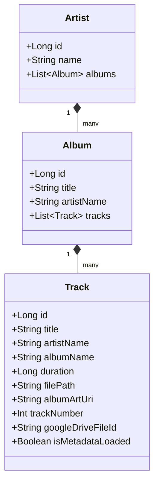
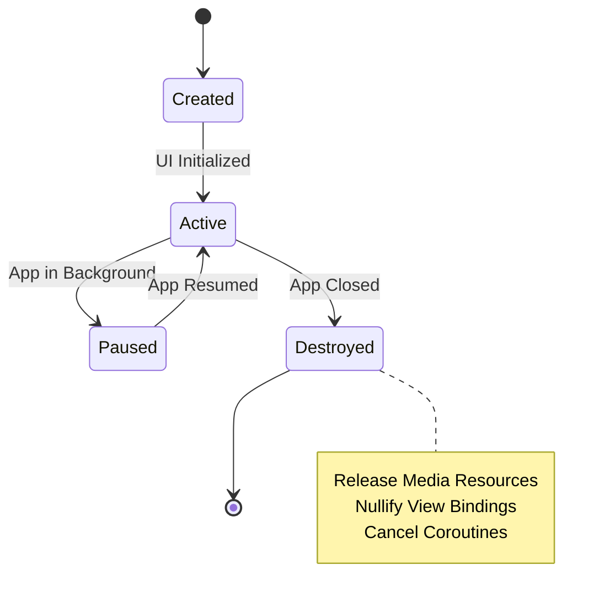

# Reference Documentation

This reference provides detailed technical information about SheepPlayer's classes, methods, and APIs. Use this as a lookup resource when working with the codebase.

## 📊 Data Models

The following class diagram illustrates the relationships and attributes of the core data models in SheepPlayer.

## 🎵 Music Player Components

### `MusicPlayer`

The core component handling audio output, security validation, and cloud integration.

#### Core Functionality
- **Loading**: Validates and prepares tracks for playback.
- **Transport Controls**: Provides play, pause, stop, and seek operations.
- **State Queries**: Allows checking the current playback position, duration, and playing status.
- **Cloud Support**: Integrates with Google Drive for remote file streaming.
- **Resource Management**: Ensures all media resources are properly released.

#### Security Implementation
- **Path Validation**: Rejects any file path attempting directory traversal.
- **Access Verification**: Confirms file existence and readability before attempting playback.
- **Error Shielding**: Wraps all low-level media operations in comprehensive exception handlers.

### `MusicPlayerManager`

A high-level coordinator that manages the interaction between the UI and the `MusicPlayer`.

#### Key Responsibilities
- **Track Selection**: Handles requests to play specific tracks or albums.
- **State Synchronization**: Keeps the UI and internal player state in sync.
- **Event Dispatching**: Notifies registered listeners when playback states change (e.g., started, paused, stopped).

## 🖼️ Image Service Layer

### `ArtistImageService`

A specialized service for discovering and securely downloading artist imagery.

#### Image Discovery Strategy
- **Multi-Engine Search**: Simultaneously queries multiple search providers (Google, Bing, DuckDuckGo) for high reliability.
- **Parallel Processing**: Uses coroutines to perform searches and downloads concurrently.
- **Redundancy**: Continues searching even if individual engines fail.

#### Security & Validation
- **Signature Verification**: Validates file "magic numbers" to ensure files are genuine images (JPEG, PNG, GIF, etc.).
- **Content Filtering**: Automatically rejects non-image files or those smaller than 150x150 pixels.
- **Secure Networking**: Enforces HTTPS for all remote requests.

#### Supported Image Formats

| Format | Validation Strategy | Description |
| :--- | :--- | :--- |
| **JPEG** | FF D8 FF | Standard photo format |
| **PNG** | 89 50 4E 47... | Lossless web graphics |
| **GIF** | 47 49 46 38 | Animated imagery |
| **WebP** | RIFF/WEBP | Modern high-compression format |
| **BMP** | 42 4D | Windows Bitmap |
| **ICO** | 00 00 01 00 | Windows Icon |
| **TIFF** | II* / MM* | High-quality tagged format |

## 🔄 Service Layer

### `GoogleDriveService`
Manages the authentication lifecycle (sign-in/sign-out) and provides access to the user's remote music collection.

### `MetadataLoadingService`
An intensive background service that crawls Google Drive to extract music metadata, broadcasting updates as discovery progresses.

### `MetadataCache`
A persistence layer that stores remote file metadata locally to improve application launch speed and reduce network usage.

## 📁 Repository Layer

### `MusicRepository`
The primary data access point for local media. It queries the Android `MediaStore`, applies security filters, and organizes raw results into the Artist-Album-Track hierarchy.

## 🎨 UI Components

### `TreeAdapter`
A complex RecyclerView adapter that renders the hierarchical music library. It uses specialized view holders for Artists, Albums, and Tracks, supporting both expansion logic and swipe-to-play gestures.

### `TreeItem` Hierarchy
Represented as a sealed structure with three variants:
1.  **ArtistItem**: Contains artist data and its current expansion state.
2.  **AlbumItem**: Contains album data and its current expansion state.
3.  **TrackItem**: Contains individual track data.

## 🛠️ Utility Classes

### `TimeUtils`
Provides formatting logic to convert raw millisecond durations into human-readable `MM:SS` strings.

### `Constants`
A centralized repository for view types, default metadata strings, and UI content descriptions.

## 🔧 MainActivity API

The `MainActivity` acts as the central coordinator for the entire application lifecycle.

#### Coordination Tasks
- **Playback Control**: Manages track and album-level playback requests.
- **Navigation**: Handles switching between functional tabs.
- **Service Integration**: Manages the lifecycle of Google Drive and metadata services.
- **State Monitoring**: Maintains a reactive state of the current track, position, and duration.

## 🔐 Security APIs

Security is enforced through multi-layered validation:
- **File Validation**: Performed at both the repository and player levels to ensure path safety and format support.
- **Integrity Checks**: Periodic verification of the application environment to detect unauthorized modifications.

## 📱 Fragment APIs

The UI is divided into focused fragments:
- **`PlayingFragment`**: Dedicated to displaying the current track, album art, and transport controls.
- **`TracksFragment`**: Handles the browsing and selection of the music library.
- **`PicturesFragment`**: Displays a gallery of images related to the currently playing artist.

## 🎯 Best Practices

- **Error Handling**: Always verify player states and use structured exception handling for IO operations.
- **Security**: Never trust external paths; always validate signatures and permissions.
- **Performance**: Leverage coroutines for all non-UI tasks and strictly follow lifecycle management rules.

## 🔄 Lifecycle Management

The application follows strict lifecycle rules to prevent memory leaks and ensure resource integrity.

