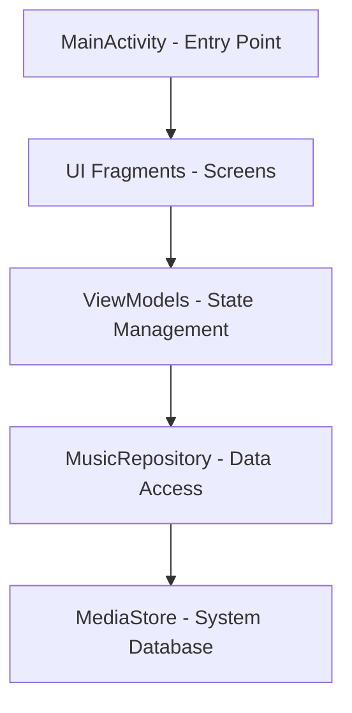

# Project Structure 🏗️

This document outlines the architecture and organization of the SheepPlayer Android application.

## 📁 Directory Structure

The SheepPlayer project is organized into several key directories:

- **Data Models**: Defined in `Data.kt`, including Artist, Album, Track, and CachedMetadata.
- **Main Activity**: `MainActivity.kt` serves as the entry point with Google Drive integration.
- **Core Playback**: `MusicPlayer.kt` handles the low-level media playback.
- **Managers**: The `manager/` directory contains `MusicPlayerManager.kt` for state management.
- **Repositories**: The `repository/` directory contains `MusicRepository.kt` for data access.
- **Services**: The `service/` directory includes specialized services for Google Drive, metadata loading, caching, and artist images.
- **UI Components**: The `ui/` directory is partitioned by feature:
    - `pictures/`: Artist image gallery components.
    - `playing/`: Currently playing UI components.
    - `tracks/`: Music library browsing components.
    - `menu/`: Settings and navigation menu.
- **Utilities**: `utils/` contains application constants and formatting helpers.
- **Resources**: The `res/` directory holds drawables, layouts, icons, navigation graphs, and configuration values.

## 🏛️ Architecture Overview

SheepPlayer follows modern Android architecture principles with clear separation of concerns using the MVVM and Repository patterns.

### MVVM + Repository Pattern

## 🔧 Core Components

### Data Layer

- **`Data.kt`**: Defines the fundamental data entities of the system.
- **`MusicRepository.kt`**: Orchestrates media data retrieval and sanitization.
- **Security**: Ensures all data access follows secure patterns.

### Business Logic

- **`MusicPlayerManager.kt`**: Coordinates the playback state between the UI and the player.
- **`MusicPlayer.kt`**: Handles the actual audio output with built-in security checks.
- **Separation**: Maintains strict boundaries between raw data and presentation logic.

### UI Layer

- **`MainActivity.kt`**: Acts as the host for navigation and permission handling.
- **Fragment-based UI**: Modularizes screens for a responsive user experience.
- **Adapters**: Handles complex data presentation like hierarchical music trees.
- **Material Design**: Follows modern Android visual standards.

### Utilities

- **`Constants.kt`**: Centralizes global application settings.
- **`TimeUtils.kt`**: Provides formatting for media durations.
- **Security Configs**: Configures network and backup policies.

## 🔄 Data Flow

1.  **App Launch**: The system requests necessary media permissions.
2.  **Data Loading**: The repository queries the system media database.
3.  **Data Processing**: Raw data is structured into a logical hierarchy (Artist → Album → Track).
4.  **UI Update**: Fragments observe the processed data and update the display.
5.  **User Interaction**: Gestures or clicks trigger playback commands.
6.  **Playback**: The player validates the request and starts audio output.

## 🛡️ Security Architecture

### Input Validation

- Strict sanitization of file paths to prevent traversal.
- White-listing of audio file extensions.
- Comprehensive null-safety throughout the data flow.

### Component Security

- Minimal exposure of application components.
- Specific intent filtering to prevent hijacking.
- Secure network configurations for cloud services.

### Data Protection

- No storage of sensitive user information.
- Controlled backup policies to prevent data leakage.
- Secure patterns for all local file interactions.

## 📦 Dependencies

The project utilizes standard Android and testing libraries, including:

- **Core Android**: Kotlin extensions, AppCompat, Fragments, and Lifecycle components.
- **UI Components**: Material Design, ConstraintLayout, and Navigation.
- **Testing**: JUnit, AndroidX Test extensions, and Espresso for UI testing.

## 🔮 Future Enhancements

- **ViewModels**: Formalizing state management with dedicated ViewModels.
- **Room Database**: Implementing local caching for performance.
- **Dependency Injection**: Adopting Hilt for better component lifecycle management.
- **Coroutines**: Migrating to structured concurrency for asynchronous tasks.
- **DataBinding**: Enhancing UI-Model synchronization.
