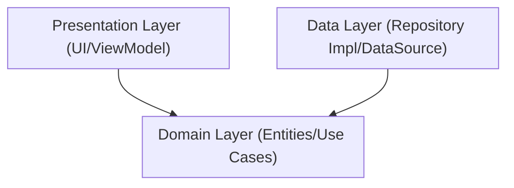
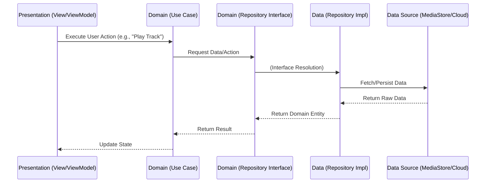

# Project Structure 🏗️

This document outlines the architecture and organization of the SheepPlayer Android application, refactored to adhere to **Domain-Driven Design (DDD)** and **Clean Architecture** principles.

## 📁 Directory Structure

The project is organized into distinct layers, ensuring separation of concerns and adherence to the Dependency Rule.

-   **Domain Layer** (`domain/`): The core of the application. Contains business logic and is independent of any framework.
    -   `model/`: Enterprise business rules (Entities and Value Objects like `Track`, `Artist`).
    -   `repository/`: Interfaces defining contracts for data access.
    -   `usecase/`: Application business rules (e.g., `PlayMusicUseCase`, `GetLibraryUseCase`).
-   **Data Layer** (`data/`): Implements the interface adapters.
    -   `repository/`: Concrete implementations of domain repositories.
    -   `datasource/`: Low-level data access (e.g., `MediaStoreDataSource`, `GoogleDriveDataSource`).
    -   `mapper/`: Converts data between Data Transfer Objects (DTOs) and Domain Entities.
-   **Presentation Layer** (`presentation/`): Handles UI and user interaction.
    -   `ui/`: Android Activities, Fragments, and custom Views.
    -   `viewmodel/`: State holders that interact with Use Cases and expose data to the UI.
-   **Infrastructure** (`di/`, `framework/`): Framework-specific implementations and dependency injection configuration.

## 🏛️ Architecture Overview

SheepPlayer follows **Clean Architecture**, enforcing a strict dependency rule where inner layers (Domain) know nothing about outer layers (Data, Presentation).

### The Dependency Rule

### Layer Interaction (DDD Context)

## 🔧 Core Components by Layer

### 1. Domain Layer (The Core)
This layer contains the "Truth" of the application. It depends on nothing.
-   **Entities**: `Artist`, `Album`, `Track`. Pure Kotlin classes with data and behavior.
-   **Use Cases**: Encapsulate specific business rules.
    -   `GetMusicLibraryUseCase`: Orchestrates retrieving and organizing music.
    -   `ControlPlaybackUseCase`: Manages player state transitions.
-   **Repository Interfaces**: `MusicRepository`, `AuthRepository`. Defines *what* data operations are possible, not *how* they are implemented.

### 2. Data Layer (The Provider)
Responsible for providing data to the domain.
-   **Repository Implementations**: `MusicRepositoryImpl`. Coordinates between local storage and cloud services.
-   **Data Sources**:
    -   `LocalMediaDataSource`: Wrapper around Android `MediaStore`.
    -   `RemoteDriveDataSource`: Wrapper around Google Drive API.
-   **Mappers**: Transforms database/network models into Domain Entities.

### 3. Presentation Layer (The Interface)
Responsible for showing data to the user and interpreting user commands.
-   **ViewModels**: `LibraryViewModel`, `PlayerViewModel`. They hold UI state and trigger Use Cases.
-   **Fragments**: `TracksFragment`, `PlayingFragment`. Observe ViewModels and render the UI.

## 🔄 Data Flow Example: Loading the Library

1.  **UI**: `TracksFragment` asks `LibraryViewModel` to load music.
2.  **Presentation**: `LibraryViewModel` executes `GetMusicLibraryUseCase`.
3.  **Domain**: `GetMusicLibraryUseCase` calls `MusicRepository.getAllMusic()`.
4.  **Data**: `MusicRepositoryImpl` calls `LocalMediaDataSource` to query the device and `RemoteDriveDataSource` if authenticated.
5.  **Data**: Results are combined and mapped to `Artist` entities.
6.  **Domain**: The Use Case applies any business sorting/filtering rules.
7.  **Presentation**: `LibraryViewModel` updates the `uiState` with the list of Artists.
8.  **UI**: `TracksFragment` renders the list via `TreeAdapter`.

## 🛡️ Security Architecture in DDD

Security logic is located in specific layers:
-   **Domain**: Defines validation rules (e.g., `Track` entity ensures its path format is valid upon creation).
-   **Data**: Sanitizes inputs before they reach the Domain (e.g., Repository filters out malicious file paths from raw queries).
-   **Presentation**: input validation for user-entered data before sending to a Use Case.

## 📦 Dependencies

-   **Domain**: Pure Kotlin (Standard Library). No Android dependencies.
-   **Data**: Android SDK (for MediaStore), Network libraries (Retrofit/Google API).
-   **Presentation**: Android Jetpack (Lifecycle, ViewModel, Navigation), UI Toolkits.
-   **DI**: Hilt or Koin (to wire layers together).
