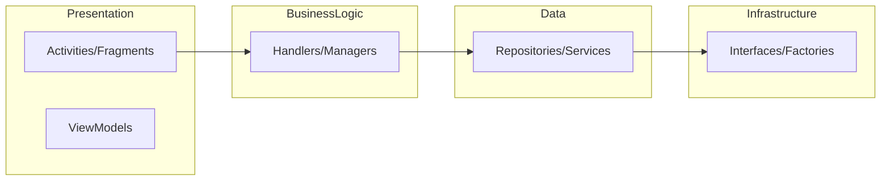
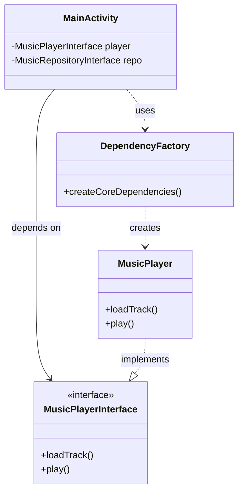

# SOLID Principles Compliance

This document outlines how the SheepPlayer codebase has been refactored to comply with SOLID principles and demonstrates the architectural improvements made.

## Overview

The refactoring addressed several SOLID principle violations in the original codebase and introduced a clean architecture that follows industry best practices for maintainable and extensible code.

## SOLID Principles Implementation

### 1. Single Responsibility Principle (SRP)

**Problem**: The original `MainActivity` handled too many responsibilities, including permission management, data loading, authentication, navigation, and UI logic.

**Solution**: The logic was extracted into specialized handler classes, each focused on a single responsibility:

- **`PermissionHandler`**: Manages permission requests and callbacks.
- **`GoogleDriveAuthHandler`**: Handles the Google Drive authentication flow.
- **`MusicDataHandler`**: Orchestrates music data loading from various sources.

### 2. Open/Closed Principle (OCP)

**Problem**: Adding new functionality previously required modifying existing core classes.

**Solution**: Extensible base classes and strategy interfaces were introduced:

- **`BaseTreeAdapter`**: Uses the template method pattern to allow customization of adapter behavior without modifying the base class.
- **`TreeDataFilter` Strategy**: Allows new filtering and sorting algorithms to be added by implementing an interface.

### 3. Liskov Substitution Principle (LSP)

**Problem**: Components were tightly coupled to specific, concrete implementations.

**Solution**: The system now depends on interfaces. Any implementation of an interface (e.g., a real player or a mock player for testing) can be substituted without affecting the system's behavior. Examples include the `MusicPlayerInterface`, `MusicRepositoryInterface`, and `GoogleDriveServiceInterface`.

### 4. Interface Segregation Principle (ISP)

**Problem**: Large, monolithic interfaces forced classes to implement methods they didn't need.

**Solution**: Interfaces were split into small, cohesive units focused on specific needs:

- **`NavigationController`**: Handles only tab switching logic.
- **`FragmentNotifier`**: Dedicated to data and state change notifications.
- **`PlaybackStateListener`**: Specifically for monitoring playback events like start, stop, and error.

### 5. Dependency Inversion Principle (DIP)

**Problem**: High-level modules were directly dependent on low-level implementation details.

**Solution**: Abstractions were introduced to decouple the layers. High-level components like activities now depend on interfaces, and the concrete implementations are provided through a factory.

- **`DependencyFactory`**: Centralizes the creation and injection of dependencies, allowing for easy swapping of implementations and improved testability.

## Architectural Improvements

### Clean Architecture Layers

### Design Patterns Used

1.  **Factory Pattern**: Used in `DependencyFactory` for decoupled object creation.
2.  **Strategy Pattern**: Applied to `TreeDataFilter` for flexible data processing.
3.  **Observer Pattern**: Implemented via callback interfaces for event handling.
4.  **Template Method Pattern**: Used in `BaseTreeAdapter` to support UI extensions.
5.  **Repository Pattern**: Standardizes data access across local and cloud sources.

## Migration Path

### Phase 1: Interface Introduction
Abstractions were defined for all major components, and existing classes were updated to implement them.

### Phase 2: Refactored Components
New, SOLID-compliant versions of the main activity, playback manager, and handlers were created.

### Phase 3: Gradual Migration
The system recommends a step-by-step replacement of legacy components with the new refactored versions to ensure stability.

## Benefits Achieved

-   **Maintainability**: Small, focused classes are easier to understand and modify.
-   **Testability**: Interface-based design allows for easy mocking in unit tests.
-   **Extensibility**: New features can be added with minimal impact on existing code.
-   **Code Quality**: Reduced coupling and higher cohesion lead to a more robust system.

## Architectural Design Pattern

The following diagram illustrates how the refactored components interact through a centralized factory and interfaces.

## Future Improvements

Potential future enhancements include adopting a formal Dependency Injection framework like Hilt, implementing more granular event systems, and using state patterns for complex player logic.
