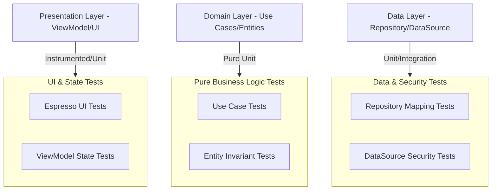

# Testing Guide (Android Music Player) 🧪

This document outlines the testing strategy for SheepPlayer, an Android music player built on **Domain-Driven Design (DDD)** and **Clean Architecture**.

## 📋 Testing Strategy (DDD & Clean)

The project follows a multi-layered testing approach, leveraging Clean Architecture to maximize unit test coverage and minimize dependence on the Android framework.

## 🎯 Testing Objectives (Music Domain)

-   **Business Logic**: Validate that `Track`, `Album`, and `Artist` entities maintain valid states and that Use Cases orchestrate the player correctly.
-   **Security**: Verify that `MusicRepository` sanitizes file paths and `ArtistImageService` validates image magic numbers.
-   **State Management**: Ensure `LibraryViewModel` and `PlayerViewModel` transition through correct states (Loading, Success, Error).
-   **UI/UX**: Confirm that swipe-to-play gestures and tab navigation work as expected.
-   **Performance**: Test the system's responsiveness when scanning a large music library (1000+ tracks).

## 🔬 1. Domain Layer Testing (Pure Unit Tests)
The domain layer is pure Kotlin and has zero Android dependencies, making tests extremely fast.

-   **Entity Invariants**: Test that a `Track` entity rejects negative durations or invalid path formats during creation.
-   **Use Case Orchestration**: Use a mock `MusicRepository` to test that `GetMusicLibraryUseCase` correctly groups tracks into artists and albums.
-   **Example**: `PlayTrackUseCase` should only call the player if the track is valid.

## 💾 2. Data Layer Testing (Unit & Integration)
Focuses on data mapping and security validation.

-   **Repository Implementation**: Test that `MusicRepositoryImpl` correctly combines data from local and remote sources and maps them to Domain Entities.
-   **Data Sanitization**: Verify that `LocalMediaDataSource` filters out files with non-audio extensions or suspicious path segments (`../`).
-   **Image Validation**: Specifically test the `ArtistImageService` against a suite of valid (JPEG, PNG) and malicious (disguised HTML/scripts) binary signatures.

## 🖥️ 3. Presentation Layer Testing (State & UI)
Focuses on UI logic and user interaction.

-   **ViewModel State**: Test that `LibraryViewModel` and `ArtistGalleryViewModel` correctly emit a `Loading` state before progressing to `Success` or `Error`.
-   **UI Logic**: Test the formatting logic in `TimeUtils` (e.g., converting 90,000ms to "1:30").
-   **Espresso UI Tests**:
    -   Verify that the "No track selected" message appears on first launch.
    -   Verify that the appropriate loading spinner or animated placeholder appears while a ViewModel is in the `Loading` state.
    -   Test the swipe-to-play gesture on a track item and confirm navigation to the "Playing" tab.
    -   Verify the tab switching behavior and persistence of the expanded artist state.

## 🎭 4. Integration Testing (Component Interaction)
Tests the interaction between multiple layers.

-   **Playback Flow**: Verify that triggering the `PlayTrackUseCase` from a ViewModel correctly updates the `MusicPlayer` state and notifies the UI.
-   **Google Drive Sync**: Test the end-to-end flow from signing in to the metadata loading service broadcasting a "Complete" signal.

## 🛠️ Testing Tools & Standards

-   **Unit Testing**: JUnit 5, Mockito/MockK (for mocking repositories in Use Case tests).
-   **Android Testing**: AndroidX Test, Espresso (for UI), Robolectric (for repository integration tests).
-   **Patterns**:
    -   **Arrange-Act-Assert (AAA)**: Use a clear structure for all tests.
    -   **Test Data Factory**: Use a centralized utility to create mock `Track`, `Album`, and `Artist` objects.

## 📊 Test Coverage Goals

-   **Domain Layer**: 95%+ (Crucial for business logic).
-   **Data Layer**: 80%+ (Focus on mappers and sanitization).
-   **Presentation Layer**: 70%+ (Focus on ViewModels and critical UI flows).
-   **Security Paths**: 100% (Non-negotiable coverage for all input validation).

## 🔍 Test Review Checklist

-   [ ] Are use cases tested with both success and failure repository results?
-   [ ] Does the image validation test suite include all supported magic numbers?
-   [ ] Are all UI interactions (swipes, taps) covered by Espresso or manual tests?
-   [ ] Is the "Red-Green-Refactor" cycle followed for all new feature development?
-   [ ] Are all time formatting edge cases (0ms, negative, >1 hour) tested?
