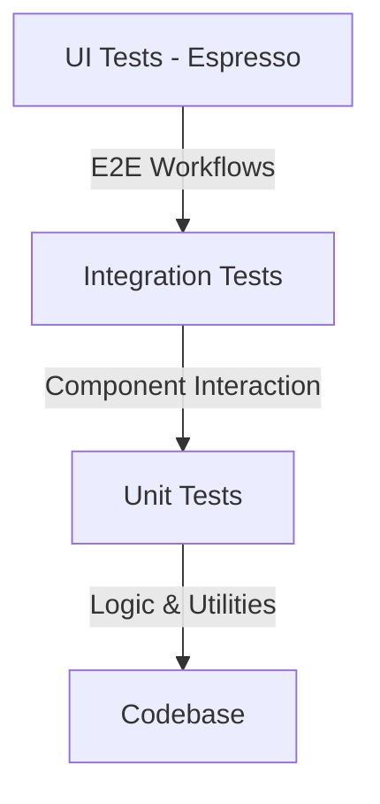

# Testing Guide 🧪

This document outlines the testing strategy, guidelines, and implementation details for the SheepPlayer Android application.

## 📋 Testing Strategy

SheepPlayer follows a comprehensive testing approach with multiple layers to ensure reliability, security, and performance.

## 🎯 Testing Objectives

-   **Functionality**: Verification of core music player operations.
-   **Security**: Validation of file path sanitization and input filtering.
-   **UI/UX**: Ensuring proper user interface behavior and responsiveness.
-   **Performance**: Testing stability and speed with large music libraries.
-   **Reliability**: Handling of edge cases and error conditions gracefully.

## 🔬 Unit Testing

Unit tests focus on the smallest testable parts of the application in isolation.

-   **Test Location**: Found in the `app/src/test/java/com/hitsuji/sheepplayer2/` directory.
-   **TimeUtils Tests**: Validate duration formatting for standard, edge, and negative cases.
-   **MusicRepository Security Tests**: Verify audio file extension validation and ensure protection against path traversal attacks.
-   **MusicPlayer Tests**: Ensure only valid and readable files are loaded into the media player engine.

## 🎭 Integration Testing

Integration tests verify that different modules or services work together correctly.

-   **Fragment Integration**: Tests the interaction between UI fragments and their underlying logic (e.g., verifying that a swipe gesture in the tracks list correctly updates the playback state).
-   **Service Interaction**: Ensures that services like the Google Drive repository and the metadata extractor communicate effectively.

## 🤖 UI Testing (Espresso)

UI tests simulate user interactions to verify the end-to-end functionality of the application.

-   **Test Location**: Found in the `app/src/androidTest/java/com/hitsuji/sheepplayer2/` directory.
-   **Permission Flow**: Validates how the app handles permission requests and subsequent data loading.
-   **Playback UI**: Tests the behavior of the play/pause toggle and the display of track information.
-   **Navigation**: Verifies that switching between bottom navigation tabs (Tracks, Playing, Pictures) works as expected.

## 📊 Test Data Management

The project utilizes a centralized `TestDataFactory` strategy to ensure consistent and reproducible test scenarios.

-   **Mock Entities**: Provides helpers to create standardized `Track`, `Album`, and `Artist` objects for tests.
-   **Hierarchy Simulation**: Can generate complex mock data structures, such as artists with multiple albums and tracks.

## 🔐 Security Testing

Security testing is a priority, focusing on protecting user data and system integrity.

-   **Malicious Path Prevention**: Explicitly tests against common attack vectors like path traversal and unauthorized file access.
-   **Extension Validation**: Ensures that only supported media formats are processed by the system.

## 🎯 Performance Testing

Performance tests ensure the app remains responsive under heavy load.

-   **Large Dataset Handling**: Validates that the system can process and display libraries containing thousands of tracks within a few seconds.
-   **Memory Usage**: Monitors memory consumption during intensive operations to prevent leaks and crashes.

## 🛠️ Testing Tools & Frameworks

The following tools are used to maintain the testing suite:

| Category | Tools |
| :--- | :--- |
| **Unit Testing** | JUnit 4, Mockito, MockK, Robolectric |
| **Android Testing** | AndroidX Test, Espresso |
| **Automation** | Gradle for execution, JaCoCo for coverage |

### Running Tests

Tests can be executed through the Gradle wrapper:

-   Run all unit tests: `./gradlew test`
-   Run all instrumented (UI) tests: `./gradlew connectedAndroidTest`
-   Generate coverage reports: `./gradlew jacocoTestReport`

## 📈 Test Coverage Goals

The project aims for high coverage across all critical areas:
-   **Unit Tests**: 80%+ coverage of business logic.
-   **Integration & UI**: Coverage of all major user journeys.
-   **Security**: 100% coverage of input validation logic.

## 🎯 Testing Best Practices

1.  **Arrange-Act-Assert**: Maintain a clear structure for every test case.
2.  **Independence**: Ensure tests do not depend on the state left by previous tests.
3.  **Descriptive Naming**: Use names that clearly state the expected behavior.
4.  **Mocking**: Isolate components by mocking external dependencies like the file system or MediaStore.
5.  **Edge Case Focus**: Prioritize testing boundary conditions and error states.

## 🔍 Test Review Checklist

-   [ ] Are all public methods covered by tests?
-   [ ] Are security validations thoroughly verified?
-   [ ] Is the UI responsive during all test scenarios?
-   [ ] Does the test data cleanup properly after execution?
