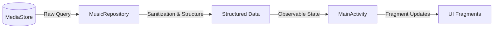
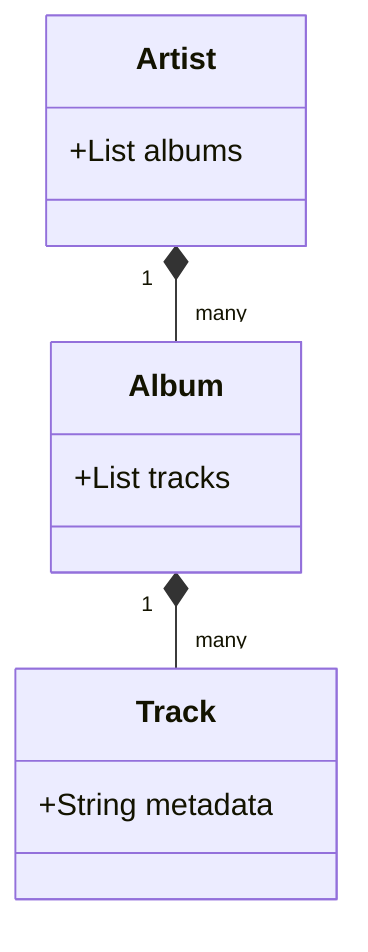

# Explanation

This section provides conceptual understanding of SheepPlayer's design decisions, architectural choices, and the reasoning behind key implementation details.

## Architecture Philosophy

### Why Repository Pattern?

SheepPlayer uses the Repository pattern to create a clean separation between data access and business logic. This architectural choice stems from several important considerations:

-   **Separation of Concerns**: The Repository pattern isolates data access logic from UI components and business logic. This means the `MainActivity` doesn't need to know the intricacies of `MediaStore` queries.
-   **Testability**: By abstracting data access behind an interface, mock implementations can be substituted during testing, allowing components to be tested without actual media access.
-   **Flexibility**: The implementation can be changed (e.g., adding a local database or web service) without affecting the rest of the application, as the interface contract remains the same.

### Security-First Design

SheepPlayer's architecture prioritizes security from the ground up, reflecting modern Android development practices.

-   **Input Validation**: Every external input is treated as potentially malicious. File paths from `MediaStore` undergo strict validation to prevent directory traversal attacks.
-   **Principle of Least Privilege**: The app requests only the minimum permissions necessary, specifically targeting audio file access on modern Android versions.
-   **Defense in Depth**: Multiple layers of validation exist. File paths are validated in both the Repository (during data loading) and the `MusicPlayer` (before playback).

## Data Flow Architecture

### The Path from MediaStore to UI

The following diagram illustrates how music data flows through the different layers of SheepPlayer.

1.  **MediaStore Query**: Raw data is queried from the system content provider.
2.  **Data Processing**: Raw tracks are organized into an Artist → Album → Track hierarchy.
3.  **State Management**: Processed data is held in the `MainActivity` as the single source of truth.
4.  **UI Presentation**: Fragments receive and transform the data for display.

### Hierarchical Data Organization

SheepPlayer organizes music in a three-level hierarchy to match the user's mental model and optimize performance.

-   **User Mental Model**: Matches how users typically think about and browse music collections.
-   **Performance**: Supports efficient lazy loading and reduces visual clutter.
-   **Technical Benefits**: Maps elegantly to the `RecyclerView` adapter pattern and enables intuitive expand/collapse animations.

## UI Design Decisions

### Bottom Navigation Choice

SheepPlayer uses bottom navigation with three primary tabs: **Tracks**, **Playing**, and **Pictures**.

-   **Thumb-Friendly**: Easily reachable on modern smartphone screens, supporting one-handed use.
-   **Workflow Alignment**: Represents natural user workflows: browsing, controlling, and exploring.
-   **Platform Consistency**: Follows Android Material Design guidelines for a native feel.

### Swipe-to-Play Gesture

The swipe-right-to-play gesture on tracks provides an efficient and satisfying interaction.

-   **Efficiency**: Reduces the interaction to a single, quick gesture.
-   **Discoverability**: Leverages well-established Android patterns found in common productivity apps.
-   **Visual Feedback**: Provides immediate, direct manipulation feedback to the user.

## Technology Choices

### Why Kotlin?

SheepPlayer is built with Kotlin for its modern language features:

-   **Null Safety**: Eliminates a large class of runtime crashes through explicit null handling.
-   **Conciseness**: Reduces boilerplate code with features like data classes and extension functions.
-   **Coroutines**: Provides clean, structured concurrency for background operations.

### MediaStore Integration

Using the `MediaStore` API over direct file scanning ensures:

-   **High Performance**: Leverages the system's indexed database for fast queries.
-   **Privacy Compliance**: Respects system-level media management and user settings.
-   **Rich Metadata**: Accesses pre-parsed album art, durations, and other tags.

## Security Design Philosophy

### Threat Model & Defense

The application is designed to defend against several key threats:

| Threat | Defense Strategy |
| :--- | :--- |
| **Malicious Paths** | Strict path sanitization and traversal checks at multiple layers. |
| **Data Injection** | Validation of metadata strings and image magic numbers. |
| **Permission Escalation** | Adherence to the principle of least privilege. |
| **Information Disclosure** | Secure logging and generic error messaging. |

The "Fail-Safe Default" approach ensures that if validation fails, the app rejects the input rather than attempting to process potentially dangerous data.

## Performance & Evolution

-   **Memory Management**: Media resources are released according to the lifecycle, and image loading is optimized for low-RAM devices.
-   **Background Processing**: `Main Thread Protection` is enforced using coroutines for all IO-bound tasks.
-   **Scalability**: The architecture is built to support future features like playlist management and cloud synchronization without requiring a major redesign.
