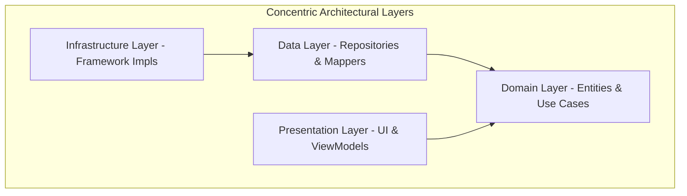

# Explanation (DDD & Clean Architecture)

This section provides a conceptual understanding of SheepPlayer's architectural decisions, explaining the "why" behind the adoption of **Domain-Driven Design (DDD)** and **Clean Architecture**.

## 🚀 The Strategic Shift

SheepPlayer has transitioned from a traditional layered architecture to a more robust, **Clean Architecture** model. This strategic choice addresses three key challenges in Android development:

1.  **Framework Entanglement**: Prevents the core music logic (e.g., how tracks are grouped into albums) from becoming coupled to the Android `MediaStore` or `Activity` lifecycle.
2.  **Testability**: Allows the most critical part of the application—the business rules—to be tested without an emulator or device.
3.  **Scalability**: Makes it simple to add new music sources (e.g., Spotify, local network storage) without rewriting the playback or UI logic.

## 🏛️ Clean Architecture Philosophy

The application is structured in concentric circles, where the most stable business rules are at the center and the most volatile technical details are on the periphery.

### The Dependency Rule
Source code dependencies only point **inwards**. Nothing in an inner circle can know anything about something in an outer circle.

-   **The Domain Layer** is the "Source of Truth." It knows nothing about the UI, the Database, or the Android SDK.
-   **The Data Layer** adapts the Domain's needs to specific storage technologies (like `MediaStore`).
-   **The Presentation Layer** adapts the Domain's state to the UI (Fragments/Activities).

## 🧩 Domain-Driven Design (DDD) Concepts

SheepPlayer uses DDD to model the complex relationships of a music library.

### Aggregates & Entities
-   **Aggregate Root**: The `Artist` is a boundary for consistency. It "owns" its `Albums`.
-   **Entities**: Objects like `Track` have a unique identity that persists even if their metadata (like title) changes.
-   **Value Objects**: Concepts like `Duration` and `FilePath` are immutable and encapsulate validation. This prevents "primitive obsession" and ensures data integrity.

### Use Cases (Interactors)
We use the **Command Pattern** for business logic. Each user action (e.g., `ScanLibrary`, `PlayTrack`) is represented by a single Use Case class. This makes the system's capabilities explicitly clear and easy to maintain.

## 💾 Data & Infrastructure

### The Repository Pattern
In our Clean Architecture, the **Repository Interface** lives in the **Domain** layer, but its **Implementation** lives in the **Data** layer.

-   **Domain Interface**: `MusicRepository.getArtists(): List<Artist>`
-   **Data Implementation**: `MusicRepositoryImpl` (calls `MediaStore` and `GoogleDrive`).

This is a classic example of **Dependency Inversion**. The high-level business logic (Domain) does not depend on the low-level data access (Data).

### Infrastructure (Framework Implementation)
The **Infrastructure** layer contains the real-world implementations of domain requirements that are platform-specific, such as the `AndroidMusicPlayer` (using `MediaPlayer`) and `PathValidator`.

## 🛡️ Security by Design

Security is a first-class citizen in our architecture:

1.  **Sanitization at the Gateway**: The Data layer sanitizes all incoming metadata from `MediaStore` before it is mapped into a `Track` entity.
2.  **Signature Validation**: The Infrastructure layer performs binary signature checks (Magic Numbers) on all downloaded artist imagery.
3.  **Safe Instantiation**: Domain Entities and Value Objects validate their state upon creation, ensuring the application never operates on "dirty" data.

## 🔄 Data Flow (Unidirectional)

Data in SheepPlayer follows a strict, unidirectional path:
1.  **UI Event**: User swiped a track.
2.  **ViewModel**: Receives the event and executes a Use Case.
3.  **Use Case**: Interacts with the Domain Repository (Interface).
4.  **Repository Impl**: Fetches data and returns Domain Entities.
5.  **ViewModel State**: The Entities are mapped to a UI State and emitted to the UI.
6.  **UI Render**: The Fragment observes the state and updates the view.
