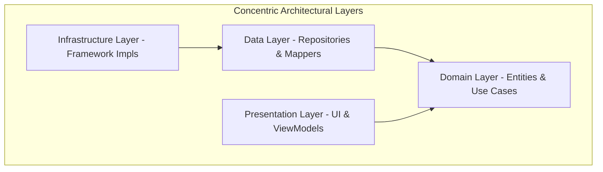

# Explanation (DDD & Clean Architecture)

This section provides a conceptual understanding of SheepPlayer's architectural decisions, explaining the "why" behind the adoption of **Domain-Driven Design (DDD)** and **Clean Architecture**.

## 🚀 The Strategic Shift

SheepPlayer has transitioned from a traditional layered architecture to a more robust, **Clean Architecture** model. This strategic choice addresses three key challenges in Android development:

1.  **Framework Entanglement**: Prevents the core music logic (e.g., how tracks are grouped into albums) from becoming coupled to the Android `MediaStore` or `Activity` lifecycle.
2.  **Testability**: Allows the most critical part of the application—the business rules—to be tested without an emulator or device.
3.  **Scalability**: Makes it simple to add new music sources (e.g., Spotify, local network storage) without rewriting the playback or UI logic.

## 🏛️ Clean Architecture Philosophy

The application is structured in concentric circles, where the most stable business rules are at the center and the most volatile technical details are on the periphery.

### The Dependency Rule
Source code dependencies only point **inwards**. Nothing in an inner circle can know anything about something in an outer circle.

-   **The Domain Layer** is the "Source of Truth." It knows nothing about the UI, the Database, or the Android SDK.
-   **The Data Layer** adapts the Domain's needs to specific storage technologies (like `MediaStore`).
-   **The Presentation Layer** adapts the Domain's state to the UI (Fragments/Activities).

## 🧩 Domain-Driven Design (DDD) Concepts

SheepPlayer uses DDD to model the complex relationships of a music library.

### Aggregates & Entities
-   **Aggregate Root**: The `Artist` is a boundary for consistency. It "owns" its `Albums`.
-   **Playback Session**: A specialized aggregate that manages the active `Track` and the current playback queue (e.g., all tracks in an album). This ensures that transitions between tracks are handled consistently by the domain logic.
-   **Entities**: Objects like `Track` have a unique identity that persists even if their metadata (like title) changes.
-   **Value Objects**: Concepts like `Duration` and `FilePath` are immutable and encapsulate validation. This prevents "primitive obsession" and ensures data integrity.

### Use Cases (Interactors)
We use the **Command Pattern** for business logic. Each user action (e.g., `ScanLibrary`, `PlayTrack`) is represented by a single Use Case class. This makes the system's capabilities explicitly clear and easy to maintain.

## 💾 Data & Infrastructure

### The Repository Pattern
In our Clean Architecture, the **Repository Interface** lives in the **Domain** layer, but its **Implementation** lives in the **Data** layer.

-   **Domain Interface**: `MusicRepository.getArtists(): List<Artist>`
-   **Data Implementation**: `MusicRepositoryImpl` (calls `MediaStore` and `GoogleDrive`).

This is a classic example of **Dependency Inversion**. The high-level business logic (Domain) does not depend on the low-level data access (Data).

### Infrastructure (Framework Implementation)
The **Infrastructure** layer contains the real-world implementations of domain requirements that are platform-specific, such as the `AndroidMusicPlayer` (using `MediaPlayer`) and `PathValidator`.

## 🛡️ Security by Design

Security is a first-class citizen in our architecture, enforced through specialized **Domain Services**:

1.  **Path Sanitization (`PathValidator`)**: A domain service that enforces strict rules on file access. It prevents **Path Traversal** attacks (e.g., `../`), validates allowed directory prefixes (Internal Cache, MediaStore), and enforces a whitelist of supported audio extensions.
2.  **Signature Validation (`BinarySignatureValidator`)**: Performs deep inspection of downloaded artist imagery using **Magic Numbers**. It ensures that a `.jpg` file is actually a JPEG and not a disguised script or HTML payload, protecting the UI layer from rendering malicious content.
3.  **Entity Invariants**: Domain Entities like `Track` validate their business rules during construction (e.g., ensuring duration is non-negative and title is not blank), preventing "dirty" data from propagating through the system.
4.  **Manual DI Isolation**: By using a manual DI container (`AppContainer`), we ensure that security services are consistently injected into all consumers (like `MusicPlayer` and `ArtistImageService`), leaving no room for unvalidated "backdoors."

## 💉 Dependency Injection (Manual Container)

To maintain the **Dependency Inversion Principle** and ensure that components are easily testable, SheepPlayer utilizes a **Manual Dependency Injection** pattern:

1.  **AppContainer**: A centralized class that manages the lifecycle and instantiation of application-wide singletons (Repositories, Services, Use Cases, and the Audio Engine).
2.  **SheepApplication**: The custom `Application` class that initializes the `AppContainer` once per application lifecycle.
3.  **ViewModelFactory**: A specialized factory that bridges the `AppContainer` and the Android ViewModel system, enabling **constructor injection** for ViewModels.
4.  **Use Case Injection**: ViewModels and Activities receive their logic via Use Case classes injected from the container, rather than interacting with repositories or framework APIs directly.

This approach provides the benefits of DI (decoupling, testability) without the overhead or complexity of a heavy framework like Hilt or Dagger in this phase of the project.

## 🔄 Data Flow (Unidirectional)

Data in SheepPlayer follows a strict, unidirectional path:
1.  **UI Event**: User swiped a track or clicked a button.
2.  **ViewModel**: Receives the event and executes a **Use Case**.
3.  **Use Case**: Encapsulates business logic (e.g., preparation, merging, validation) and interacts with Domain Repository interfaces.
4.  **Repository Impl**: Fetches data from data sources (MediaStore, Google Drive) and returns Domain Entities.
5.  **ViewModel State**: Maps Domain Entities to UI-friendly state and emits via `LiveData` or `Flow`.
6.  **UI Render**: Fragment observes the state and updates the Material 3 components.

## ⌛ User Feedback & Background Operations

In a music player, many operations occur in the background to ensure a smooth UI. SheepPlayer prioritizes user feedback during these asynchronous tasks through a **Minimalist Notification Strategy**:

-   **Asynchronous Processing**: Tasks like metadata scanning and image retrieval are offloaded to background threads.
-   **Explicit State Signaling**: ViewModels and Services explicitly transition through states (Started, Progress, Success, Error).
-   **Global Sync Indicator**: Instead of repetitive and intrusive Toast notifications that can clutter the UI, SheepPlayer uses a persistent "Syncing..." chip at the activity level. This provides a unified "running icon" that is visible across all fragments, signaling background work without interrupting the user's flow.
-   **Contextual Feedback**: For specific tasks, the app uses character-driven indicators, such as an animated "Sheep" for image discovery, making the wait time feel more integrated into the app's personality.
