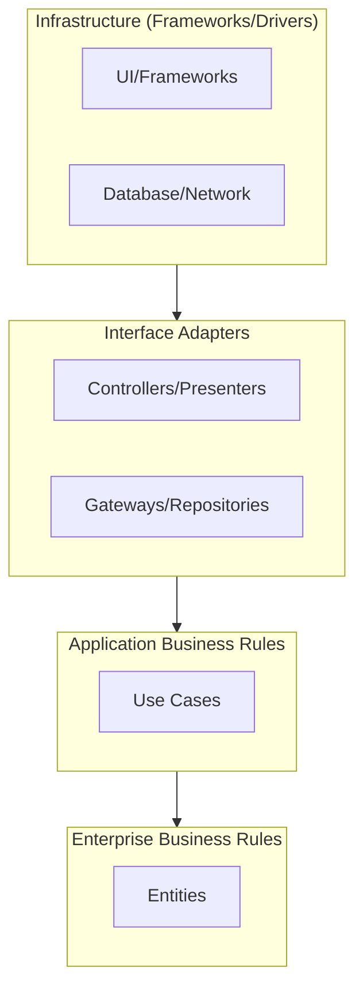

# SOLID Principles Compliance (DDD & Clean Architecture)

This document outlines how the SheepPlayer codebase adheres to SOLID principles through the adoption of **Domain-Driven Design (DDD)** and **Clean Architecture**.

## SOLID Principles in DDD Context

### 1. Single Responsibility Principle (SRP)

**Problem**: Traditional Android architectures often burden `MainActivity` or ViewModels with business logic, data fetching, and UI rendering.

**DDD Solution**:
-   **Use Cases**: Each Use Case encapsulates a single business rule or user interaction (e.g., `PlayMusicUseCase`, `LoadLibraryUseCase`).
-   **Repositories**: Focus solely on data abstraction (fetching/saving entities).
-   **Entities**: Represent domain concepts (`Artist`, `Track`) with intrinsic behavior, separate from persistence concerns.

**Benefit**: Changes to business rules (e.g., "play only if duration > 30s") affect only one Use Case, leaving the UI and Data layers untouched.

### 2. Open/Closed Principle (OCP)

**Problem**: Adding new features (e.g., a new music source like Spotify) often requires modifying existing classes.

**DDD Solution**:
-   **Polymorphic Repositories**: The Domain layer defines a `MusicRepository` interface.
-   **Strategy Pattern**: Use Cases depend on abstractions. New data sources (e.g., `CloudMusicRepositoryImpl`) can be added without changing the Use Cases or the UI.
-   **Extensions**: Functionality can be extended via Decorators or new implementations of existing interfaces.

**Benefit**: The core domain logic is closed for modification but open for extension through new implementations.

### 3. Liskov Substitution Principle (LSP)

**Problem**: Tightly coupled components make it hard to swap implementations (e.g., replacing a real database with a mock for testing).

**DDD Solution**:
-   **Interface Contracts**: All dependencies (Repositories, Services) are defined by interfaces in the Domain layer.
-   **Consistent Behavior**: Any implementation of `MusicRepository` (Local, Remote, Mock) adheres to the same contract, ensuring the system behaves predictably regardless of the underlying data source.

**Benefit**: Seamlessly swap production components for test doubles without breaking the application.

### 4. Interface Segregation Principle (ISP)

**Problem**: Large "God Interfaces" force classes to implement methods they don't use.

**DDD Solution**:
-   **Focused Use Cases**: Instead of a monolithic `MusicManager`, we have specific Use Cases like `GetLibrary`, `PlayTrack`, `PauseTrack`.
-   **Granular Repositories**: Separate interfaces for distinct domains (e.g., `AuthRepository` vs. `MusicRepository`).

**Benefit**: Components depend only on the specific methods relevant to their function.

### 5. Dependency Inversion Principle (DIP)

**Problem**: High-level modules (Business Logic) depending on low-level modules (Database, Network API).

**DDD Solution**:
-   **Inverted Dependencies**: The Domain layer (High-level) defines interfaces. The Data layer (Low-level) implements them.
-   **Dependency Injection**: Dependencies are injected at runtime, ensuring the Domain layer remains pure and unaware of infrastructure details.

**Benefit**: The core business logic is completely decoupled from frameworks, databases, and UI, making it robust and testable.

## Architectural Improvements

### Clean Architecture Layers

### Design Patterns Used

1.  **Repository Pattern**: Mediates between the Domain and Data mapping layers using a collection-like interface for accessing domain objects.
2.  **UseCase (Interactor) Pattern**: Encapsulates application-specific business rules.
3.  **Domain Service Pattern**: Handles stateless business logic that doesn't naturally fit into an Entity (e.g., `PathValidator`, `BinarySignatureValidator`). These services maintain SRP by isolating complex validation rules.
4.  **Dependency Injection**: Facilitates loose coupling and testability.
5.  **Mapper Pattern**: Transforms data between layers (e.g., Database Model -> Domain Entity -> UI Model).

## Benefits Achieved

-   **Testability**: Domain logic can be unit-tested in isolation (pure Kotlin).
-   **Maintainability**: Clear separation of concerns makes the codebase easier to understand and modify.
-   **Flexibility**: The UI and Data layers can evolve independently of the core business logic.
-   **Scalability**: New features can be added as new Use Cases and Entities without cluttering existing code.
