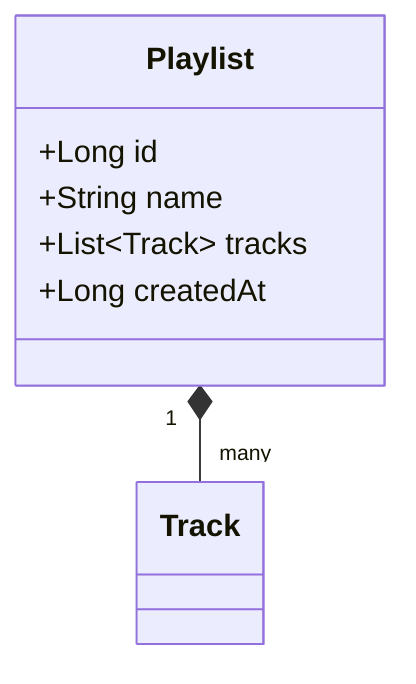

# How-to Guides

Step-by-step instructions for solving specific problems with SheepPlayer development.

**Prerequisites**: Basic Android development knowledge and SheepPlayer codebase familiarity.

## Development

### Add Support for New Audio Formats

**Problem**: You want to support audio formats not currently recognized by SheepPlayer.

1.  **Update the validation method**: In `MusicRepository.kt`, locate the `isValidAudioFile` method. Add the new file extensions (e.g., `.opus`, `.wma`) to the set of valid extensions.
2.  **Ensure case-insensitivity**: The validation should convert the file extension to lowercase before comparison.
3.  **Test the new format**: Add a sample file with the new extension to your test device's music folder and verify it appears in the library.
4.  **Update documentation**: Reflect the newly supported formats in the project's technical specifications.

### Implement Dark Mode Theme

**Problem**: Users want a dark theme option for better nighttime usage.

1.  **Create theme variants**: Define a new dark theme style in `res/values/themes.xml` (or `themes-night.xml`), inheriting from a `DayNight` Material3 parent. Specify dark-appropriate colors for `colorPrimary`, `colorOnPrimary`, and other surface attributes.
2.  **Implement theme switching**: In `MainActivity`, create a method that applies the selected theme ID before calling `setContentView`.
3.  **Persist user preference**: Use a local storage solution like `SharedPreferences` or `DataStore` to save the user's theme choice.
4.  **Update UI components**: Ensure all fragments and custom views are using theme attributes (e.g., `?attr/colorSurface`) rather than hardcoded colors to ensure they respond correctly to theme changes.

### Add Playlist Management

**Problem**: Users want to create and organize custom playlists.

1.  **Define the Playlist model**: Create a structure to represent a playlist, containing a unique ID, a name, a list of associated tracks, and a creation timestamp.

2.  **Implement persistence**: Use a local database (like Room) to store playlist definitions and track associations.
3.  **Build the management UI**: Create a new fragment and a corresponding RecyclerView adapter to display and manage playlists.
4.  **Integrate with track lists**: Add "Add to Playlist" functionality to existing track display components.

### Integrate System Media Controls

**Problem**: Your app needs to work with Android's media control notifications and lock screen controls.

1.  **Add Media dependencies**: Include the AndroidX Media library in your module-level build configuration.
2.  **Initialize MediaSession**: Create and configure a `MediaSessionCompat` instance within the `MusicPlayerManager`. Implement callbacks for standard transport controls like play, pause, and skip.
3.  **Synchronize Metadata**: Whenever a new track starts playing, update the `MediaSession` metadata with the track title, artist name, and album art to ensure it appears correctly in the system notification.

## Security

### Implement File Access Security

**Problem**: You need to validate all file access to prevent security vulnerabilities.

1.  **Create a centralized validator**: Define a security utility that checks for path traversal attempts (e.g., ensuring no `..` segments) and verifies that the file resides within an authorized storage directory.
2.  **Enforce extension white-listing**: Only allow files with known and safe audio extensions.
3.  **Apply validation globally**: Use this validator at every point where the application opens or reads a file from storage.
4.  **Log security events**: Record any rejected file access attempts for security monitoring and debugging.

### Enable Code Obfuscation

**Problem**: You need to protect your code and reduce APK size for production.

1.  **Configure Build Types**: In the application's Gradle configuration, enable `isMinifyEnabled` for the release build type.
2.  **Define ProGuard rules**: Create a `proguard-rules.pro` file to specify which classes and members should be kept (e.g., entry points, serialized models, and library-specific rules).
3.  **Verify Release Functionality**: Thoroughly test the obfuscated release build to ensure that no critical code was accidentally stripped or renamed in a way that breaks functionality.

## Testing

### Add Unit Tests for New Features

**Problem**: You've added a feature and need comprehensive tests.

1.  **Create a test class**: Use JUnit to define a test suite in the `app/src/test/java` directory.
2.  **Follow the TDD pattern**: Define your test cases (basic success, edge cases, error conditions) before or during implementation.
3.  **Mock dependencies**: Use a mocking framework like Mockito to isolate the component under test from external services like the repository or network.
4.  **Verify behaviors**: Use assertions to confirm that the component returns the expected results and interacts correctly with its dependencies.

### Add Device UI Tests

**Problem**: You need to test UI interactions on actual devices or emulators.

1.  **Use AndroidX Test**: Create instrumented test classes in the `app/src/androidTest/java` directory.
2.  **Define UI Rules**: Use `ActivityTestRule` to launch the target activity before each test.
3.  **Implement Espresso actions**: Use Espresso's `onView` and `perform` methods to simulate user clicks, swipes, and text entry, then use `check` to verify the resulting UI state.

## User Interface

### Add List Animations

**Problem**: You want smooth animations when users expand/collapse artists and albums.

1.  **Define animator resources**: Create XML animator files for expanding and collapsing (e.g., rotating a chevron icon).
2.  **Trigger animations in the adapter**: When an item's expansion state changes in the `TreeAdapter`, load and start the appropriate animation on the target view.
3.  **Ensure smooth transitions**: Use consistent durations and interpolators for a polished feel.

### Implement Music Search

**Problem**: Users need to quickly find specific songs, artists, or albums.

1.  **Add a Search component**: Integrate a `SearchView` into your fragment's layout or toolbar.
2.  **Implement filtering logic**: Create a utility that iterates through the music hierarchy, filtering artists, albums, and tracks based on whether their titles or names contain the search query (ignoring case).
3.  **Update the display**: Submit the filtered list to the `TreeAdapter` to update the UI in real-time as the user types.

## Performance

### Handle Large Music Collections

**Problem**: Your app becomes slow with users who have thousands of music files.

1.  **Implement Pagination/Lazy Loading**: Update the repository to query media in batches and configure the RecyclerView to load more items as the user scrolls.
2.  **Use efficient updates**: Implement `DiffUtil` in your adapters to ensure that only the items that have actually changed are redrawn.
3.  **Optimize Caching**: Store processed music structures in a local cache (like a Room database) to avoid repeated, expensive system media queries.

### Reduce Memory Usage

**Problem**: Your app uses too much memory and crashes on low-end devices.

1.  **Optimize Image Loading**: When loading album art, calculate an appropriate `inSampleSize` to downsample images to the size they will actually be displayed.
2.  **Manage ViewHolders**: Ensure that any large resources (like bitmaps) held by ViewHolders are cleared when the view is recycled.
3.  **Profile memory**: Regularly use the Android Studio Memory Profiler to identify and fix leaks or excessive allocations.

## Deployment

### Create a Production Release

**Problem**: You need to build and distribute your app through the Play Store.

1.  **Increment versioning**: Update the `versionCode` and `versionName` in your build configuration.
2.  **Generate a Signed Bundle**: Use the Android Studio wizard to build a signed Android App Bundle (AAB) using your production keystore.
3.  **Perform Final Validation**: Test the release candidate on multiple devices to ensure stability and performance.

### Set Up Automated Building (CI)

**Problem**: You want to automatically test and build your app when code changes.

1.  **Define a CI workflow**: Create a YAML configuration (e.g., for GitHub Actions) that specifies the build environment (e.g., Ubuntu with JDK 11).
2.  **Automate tasks**: Configure the workflow to cache Gradle dependencies, run all unit tests, and upload the test reports upon every push or pull request.
3.  **Monitor health**: Use the CI dashboard to quickly identify regressions or build failures.
