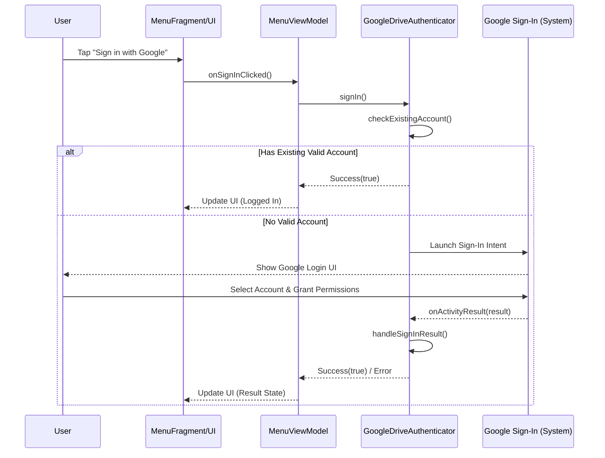
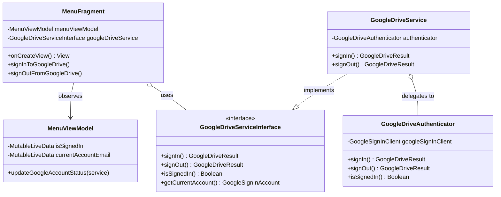

# Google Drive Integration Setup

## Overview

The SheepPlayer app includes Google Drive integration to load and play music files directly from Google Drive. However, this requires proper Google API configuration.

## Authentication Flow (Google Drive/Docs)

The following diagram illustrates the sequence of interactions during the Google Drive/Docs authentication process.

### Authentication Class Diagram

The following class diagram shows the relationships between the components involved in the authentication flow.

## Setup Requirements

### 1. Google Cloud Console Setup

1. **Create a Google Cloud Project**:
    - Go to [Google Cloud Console](https://console.cloud.google.com/)
    - Create a new project or select an existing one.
    - Enable the following APIs: **Google Drive API** and **Google Sign-In API**.

2. **Configure OAuth 2.0**:
    - Go to "Credentials" in the Google Cloud Console.
    - Create OAuth 2.0 Client IDs for Android.
    - Add your app's SHA-1 fingerprints (see below).

### 2. Get SHA-1 Fingerprints

Run the following procedures in your project directory:

-   **For Debug Builds**: Use the `keytool` utility to list the contents of your local `debug.keystore`, typically found in the `.android` directory of your user home. The default alias is `androiddebugkey` and the default password is `android`.
-   **For Release Builds**: If you have a production keystore, use the `keytool` utility with your specific keystore path and alias to retrieve the SHA-1 fingerprint.

### 3. Configure Firebase (Recommended)

1. **Create Firebase Project**:
    - Go to [Firebase Console](https://console.firebase.google.com/)
    - Create a new project or use an existing Google Cloud project.
    - Add an Android app with the package name: `com.hitsuji.sheepplayer`

2. **Add SHA-1 Fingerprints**:
    - In the Firebase Console, navigate to Project Settings.
    - Add the SHA-1 fingerprints retrieved in the previous step.

3. **Download Configuration**:
    - Download the `google-services.json` file.
    - Place it in the `app/` directory of your project.

### 4. Add Google Services Plugin

1. **Module Level**: Add the Google Services plugin ID to your application's `build.gradle.kts` file within the `plugins` block.
2. **Project Level**: Add the Google Services plugin to your project-level `build.gradle.kts` file, specifying the appropriate version (e.g., "4.4.0") and setting `apply` to `false`.

## Current Status

The application currently includes:

- ✅ Google Drive API dependencies
- ✅ Google Sign-In integration
- ✅ Drive file discovery and metadata extraction
- ✅ Music playback from Google Drive
- ✅ Background metadata loading service
- ✅ SQLite metadata caching system
- ✅ Authentication flow with menu integration
- ✅ Progress tracking and user feedback
- ❌ `google-services.json` configuration file (Must be added manually)
- ❌ SHA-1 fingerprint registration (Must be completed in the console)

## Error Messages

-   **"Sign in cancelled or failed"**: Usually indicates a missing or incorrect Google services configuration.
-   **"GoogleSignIn not properly configured"**: Typically means the `google-services.json` file is missing.
-   **Authentication failures**: Double-check that your SHA-1 fingerprints are correctly registered in the Firebase or Google Cloud console.

## Manual Testing (Alternative)

If you prefer not to set up Google services at this time, you can:
1.  Disable or comment out the Google Drive initialization logic.
2.  Rely solely on local music files; the app will function normally for local storage music.

## File Structure

The Google Drive and authentication components are organized as follows:

-   **Service Layer**: Contains `GoogleDriveService`, `GoogleDriveRepository`, `GoogleDriveFileDiscovery`, `GoogleDriveMetadataService`, `MetadataLoadingService`, `MetadataCache`, `MetadataCacheDbHelper`, and `MusicMetadataExtractor`.
-   **Authentication Logic**: Located in the `auth/` subdirectory as `GoogleDriveAuthenticator`.
-   **UI & Logic**: Found in the `ui/menu/` directory, including `MenuFragment` and `MenuViewModel`.
-   **Configuration**: Requires the `google-services.json` file in the project root.

## Troubleshooting

1.  **Check Logs**: Monitor "GoogleDriveService" logs in Android Studio for detailed error reports.
2.  **Verify Package Name**: Ensure the package name exactly matches `com.hitsuji.sheepplayer`.
3.  **Check SHA-1**: Confirm that the fingerprints in the console match those from your build environment.
4.  **Restart App**: After making configuration changes, perform a clean build and restart the application.

## Support

For issues specifically related to Google Sign-In or Firebase Authentication, consult the official Google Identity and Firebase documentation.
