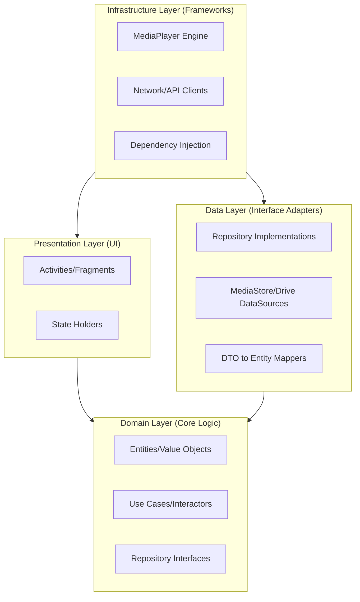
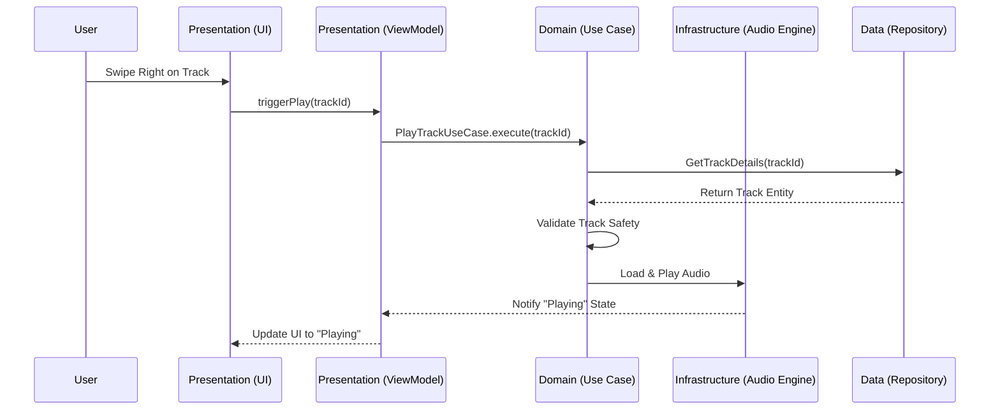
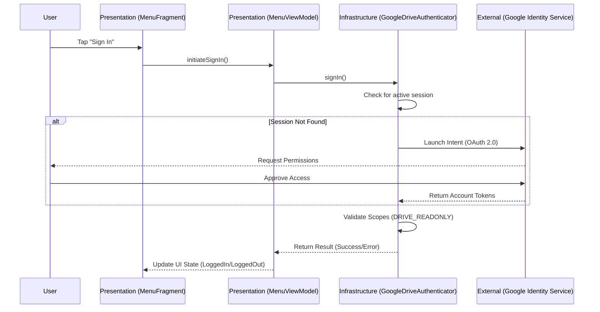

# Project Structure (DDD & Clean Architecture) 🏗️

This document outlines the architecture of SheepPlayer, refactored into a strictly layered **Clean Architecture** with a **Domain-Driven Design (DDD)** core.

## 📁 Architectural Layering

The codebase is partitioned into four primary circles, with the dependency rule pointing strictly inward.

## 📂 Package Organization

### 1. `domain/` (The Core)
Contains the essential business rules of the music player. No Android dependencies.
-   **`model/`**: `Track`, `Album`, `Artist` (Entities) and `Duration`, `FilePath` (Value Objects).
-   **`usecase/`**: Specific interactors like `ScanLibrary`, `PlayTrack`, `SyncCloudMusic`.
-   **`repository/`**: Interfaces defining how the system accesses music data.

### 2. `data/` (The Persistence)
Adapts domain requests to technical storage.
-   **`repository/`**: Concrete implementations of domain repositories (e.g., `MusicRepositoryImpl`).
-   **`datasource/`**: Wrappers for Android `MediaStore` and the Google Drive API.
-   **`mapper/`**: Logic to convert raw system data into domain models.

### 3. `presentation/` (The UI)
Renders the domain state and captures user intent.
-   **`ui/`**: Android-specific views (Fragments, Activities, Adapters).
-   **`viewmodel/`**: State holders that communicate with the domain Use Cases via reactive streams.

### 4. `infrastructure/` (The Platform)
Framework-specific tools that implement domain or data requirements.
-   **`player/`**: The actual `MediaPlayer` implementation that fulfills the domain's audio requirements.
-   **`security/`**: Real-world implementation of path and image validation.

## 🔄 Interaction Flow: "Swipe to Play"

This sequence illustrates how a user action traverses the architecture.

## 🔄 Interaction Flow: Google Drive Login

This sequence illustrates the authentication process for cloud-based music services.

## 🛡️ Security Boundaries

Security is handled at the outermost layers before reaching the domain:
1.  **UI**: Basic input validation.
2.  **Data Layer**: Mappers ensure raw data is sanitized into Domain Entities.
3.  **Infrastructure**: Binary signature validation (Magic Numbers) is performed before images are sent to the Presentation layer.
4.  **Domain Layer**: Enforces invariants (e.g., a `Track` object cannot be instantiated with an invalid path).
