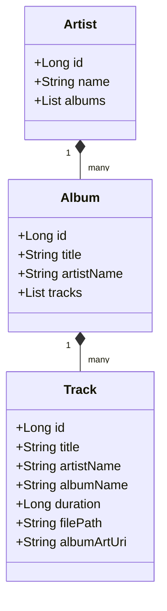

# Reference

Complete technical specification of SheepPlayer classes, methods, and constants.

-   **[SOLID Compliance](../explanation/solid-compliance.md)** - SOLID principles adherence analysis

## Classes

### Data Models
The core data structure follows a hierarchical Artist → Album → Track model.

-   **Artist**: Contains a unique MediaStore ID, the artist's name, and a collection of their albums.
-   **Album**: Includes a unique MediaStore ID, the title, the artist's name, and a collection of tracks.
-   **Track**: Stores the unique MediaStore ID, title, artist and album names, duration in milliseconds, the full file system path, and an optional URI for artwork.

### Core Classes

#### `MusicPlayer`
The primary audio playback controller utilizing the Android `MediaPlayer` engine. It handles track loading with built-in security validation, transport controls (play, pause, stop, seek), and resource management.

#### `MusicPlayerManager`
A high-level wrapper for the `MusicPlayer` that manages application state, synchronizes the UI, and provides callback interfaces for playback event changes.

#### `MusicRepository`
Handles data access by querying the Android `MediaStore`. It is responsible for loading, sanitizing, and structuring media data while enforcing strict security policies on file access.

### UI Classes

#### `TreeAdapter`
A specialized RecyclerView adapter designed for hierarchical music browsing. It manages specialized ViewHolders for Artists, Albums, and Tracks, supporting expand/collapse logic and track interactions.

#### `TreeItem` (Sealed Class)
A formal representation of the different types of items within the music tree, including `ArtistItem`, `AlbumItem`, and `TrackItem`, each holding its respective data and UI state.

### Fragment Classes

#### `MainActivity`
The central host for the application's navigation and global state, coordinating data flow between repositories and UI fragments.

#### `PlayingFragment`
A dedicated screen for displaying the currently active track's details, artwork, and playback controls.

#### `TracksFragment`
Displays the music library in a searchable, hierarchical tree view.

### Utility Classes

#### `TimeUtils`
Provides static helpers for converting raw durations into human-readable time strings (e.g., "MM:SS").

#### `Constants`
A centralized repository for view types, system metadata strings, and UI-specific identifiers.

## Permissions

### Required Permissions
The application requires the following permissions to function correctly:

-   **Audio Access (API 33+)**: `READ_MEDIA_AUDIO` for accessing music files on modern Android versions.
-   **Legacy Storage Access**: `READ_EXTERNAL_STORAGE` for compatibility with older devices (up to API 32).
-   **Playback Stability**: `WAKE_LOCK` to ensure continuous audio playback when the device screen is off.

## MediaStore Queries

### Audio Discovery Process
The application queries the Android `MediaStore` to discover local audio files. This process involves:

1.  **URI Resolution**: Selecting the appropriate external media volume based on the Android version.
2.  **Projection**: Requesting specific columns including ID, Title, Artist, Album, Duration, File Data, and Album ID.
3.  **Filtering**: Using a selection filter to include only files explicitly marked as music within the system database.

## Supported Audio Formats
SheepPlayer supports the following standard audio formats:
-   **MP3** (.mp3)
-   **M4A** (.m4a)
-   **WAV** (.wav)
-   **FLAC** (.flac)
-   **OGG** (.ogg)
-   **AAC** (.aac)

## Security Validations

### File Path Validation
All file paths are rigorously validated to prevent directory traversal attacks (detecting `../` segments), blocking access to sensitive system files, and ensuring only whitelisted extensions are processed.

### Input Sanitization
Data retrieved from system APIs is never trusted implicitly. All strings are checked for null values and replaced with defaults where necessary, and all file paths are re-validated immediately before any playback attempt.

## Error Codes & States

-   **MusicPlayer Errors**: Covers invalid file paths, IO exceptions during loading, and general engine failures.
-   **Permission States**: Tracks whether the user has granted or denied necessary media access, providing feedback for either state.

## View Identifiers

The application uses standard resource IDs to link code logic with XML layouts for the main activity, functional fragments (Playing, Tracks), and individual list items for the music hierarchy.
