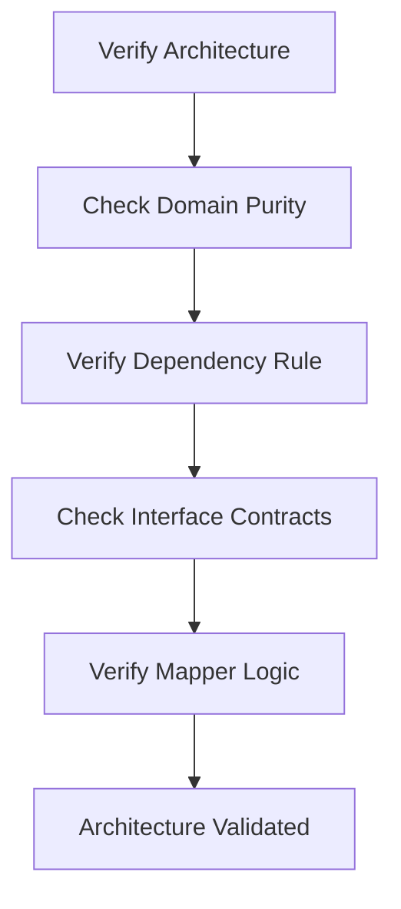

# Test Plan: Architecture & DDD Compliance

This document serves as the **Test List** (Task Plan) for verifying that the implementation adheres to **Domain-Driven Design (DDD)** and **Clean Architecture** principles.

## 🏗️ Structural Integrity

-   [ ] **Domain Purity**: Verify that the `domain` package contains zero Android or third-party framework dependencies (e.g., `android.os`, `androidx`).
-   [ ] **Dependency Rule**: Use a static analysis check (or manual audit) to ensure `domain` depends on nothing, and `data`/`presentation` depend only on `domain`.
-   [ ] **Interface Inversion**: Verify that all repository implementations in the `data` layer strictly implement interfaces defined in the `domain` layer.
-   [ ] **Visibility**: Ensure that internal data structures (DTOs) in the `data` layer are never exposed to the `presentation` layer.

## 🧩 Domain Modeling (Entities & Value Objects)

-   [ ] **Track Invariants**:
    -   [ ] Creating a `Track` with a negative duration should fail.
    -   [ ] Creating a `Track` with an empty title should be handled (e.g., default to "Unknown Title").
-   [ ] **Value Object Equality**:
    -   [ ] Verify that two `Duration` objects with the same milliseconds are considered equal.
    -   [ ] Verify that two `FilePath` objects with the same path string are considered equal.
-   [ ] **Aggregate Integrity**:
    -   [ ] Adding an `Album` to an `Artist` should correctly update the `Artist`'s album list.
    -   [ ] Removing a `Track` from an `Album` should be reflected in the `Album` entity.

## 🚀 Use Case Execution (Interactors)

-   [ ] **GetMusicLibraryUseCase**:
    -   [ ] Should call `MusicRepository.getAllMusic()` exactly once.
    -   [ ] Should return a sorted list of `Artist` aggregates.
    -   [ ] Should handle repository errors gracefully by returning a failure result.
-   [ ] **PlayMusicUseCase**:
    -   [ ] Should validate the `Track`'s `FilePath` via the `PathValidator` before instructing the player.
    -   [ ] Should transition the `PlaybackSession` state to `Buffering` then `Playing`.
-   [ ] **SyncCloudMusicUseCase**:
    -   [ ] Should trigger the `RemoteCloudDataSource` only if the `AuthRepository` reports a logged-in user.

## 🔄 Data Layer & Mappings

-   [ ] **Entity Mapping**:
    -   [ ] `TrackMapper` should correctly convert a `MediaDto` with null fields into a valid `Track` entity with default values.
    -   [ ] `TrackMapper` should sanitize the `title` and `artistName` strings during conversion.
-   [ ] **Repository Coordination**:
    -   [ ] `MusicRepositoryImpl` should successfully merge tracks from both `LocalMediaDataSource` and `RemoteDriveDataSource`.
    -   [ ] Duplicate tracks (same ID/Path) between sources should be resolved according to business rules.

## 🧪 Architecture Verification Flow

