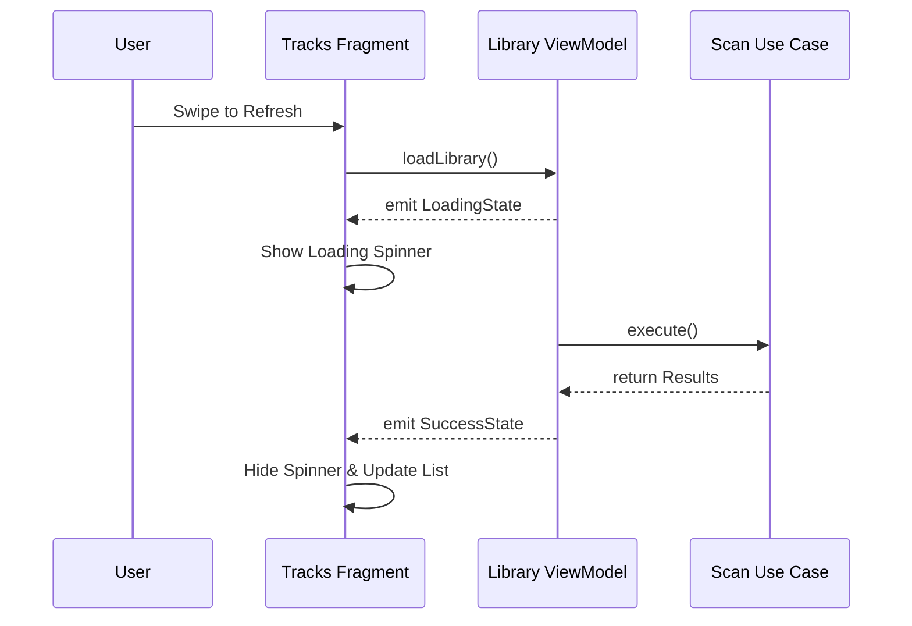

# Test Plan: Music Player Features

This document serves as the **Test List** (Task Plan) for verifying that the music player features and user interface are implemented correctly and respond as specified.

## 🎵 Library Discovery & Management

-   [ ] **Scan Library (Local)**:
    -   [ ] Should query `MediaStore` and correctly group 10 tracks into 2 albums and 1 artist.
    -   [ ] Should ignore non-music files (e.g., ringtones, system sounds).
-   [ ] **Sync Cloud Music (Remote)**:
    -   [ ] Should successfully fetch and list files from a mocked `RemoteCloudDataSource`.
    -   [ ] Should successfully cache retrieved cloud metadata into the `LocalCacheDataSource`.
-   [ ] **Library Update (Playlist Sync)**:
    -   [ ] Should show a **loading spinner** in the Tracks tab while the scan is active.
    -   [ ] Should correctly update the `LibraryUiState` to `Success` with the new track count.

## 🔊 Audio Playback & System Integration

-   [ ] **MediaSession Integration**:
    -   [ ] Verify that a `MediaSession` is created upon starting playback.
    -   [ ] Ensure lock screen controls are updated with the correct track metadata.
-   [ ] **Foreground Notification**:
    -   [ ] Verify that a notification appears when music starts playing.
    -   [ ] Verify that the notification provides "Play", "Pause", and "Stop" actions.
    -   [ ] Ensure the notification dismisses correctly when playback is stopped.
-   [ ] **Audio Focus Handling**:
    -   [ ] Simulate a phone call and verify the player pauses.
    -   [ ] Simulate a short notification and verify the player "ducks" (lowers volume) then restores it.

## 🔍 Library Discovery & Search

-   [ ] **Global Search**:
    -   [ ] Type an artist name in the SearchBar and verify the list filters in real-time.
    -   [ ] Clear the search and verify the full hierarchical library returns.
-   [ ] **Empty Library State**:
    -   [ ] Mock an empty `MediaStore` and verify the "No Music Found" view is displayed.

## 🎨 Visual Design & Layout

-   [ ] **Dynamic Color (Material You)**:
    -   [ ] Change the system wallpaper/theme and verify the app's primary and secondary colors adapt correctly.
-   [ ] **Edge-to-Edge Display**:
    -   [ ] Verify that the background renders behind the status bar and navigation bar.
    -   [ ] Ensure that bottom navigation items have appropriate system bar padding to prevent clipping.

## 🖼️ Artist Gallery (Pictures Tab)

-   [ ] **Image Discovery**:
    -   [ ] Should start the animated **"Sheep" placeholder** while searching for images.
    -   [ ] Should download at least 5 images for a known artist from mocked search results.
    -   [ ] Should replace the placeholder with the first successfully downloaded image.
-   [ ] **Infinite Scroll (Circular Buffer)**:
    -   [ ] Verify that scrolling to the bottom of the 10-image gallery triggers the loading of the next image.
    -   [ ] Verify the oldest image is removed from the buffer to maintain a fixed count of 10.

## 🖥️ UI State & Loading Feedback

-   [ ] **Library Scan Progress**:
    -   [ ] `LibraryViewModel` should emit `Loading` state during the entire `MediaStore` query.
    -   [ ] The UI should show a non-blocking progress indicator (e.g., small spinner in the header).
-   [ ] **Artist Search Progress**:
    -   [ ] `ArtistGalleryViewModel` should emit `Loading` state during the image download phase.
    -   [ ] The UI should show the animated "Sheep" placeholder in the pictures gallery.

## 📱 Navigation & Tab State

-   [ ] **Persistence**:
    -   [ ] Verify that the expanded/collapsed state of an artist is maintained when switching between tabs.
    -   [ ] Verify that the current playback position is maintained across configuration changes (e.g., screen rotation).

## 🔄 User Interaction Flow

