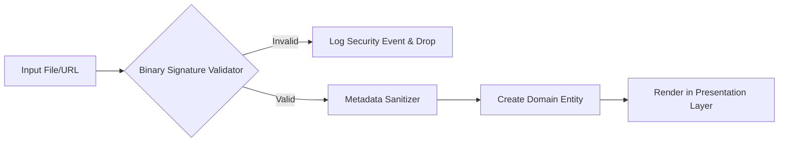

# Test Plan: Security & Data Integrity

This document serves as the **Test List** (Task Plan) for verifying the implementation of security features, input validation, and system integrity.

## 🛡️ File System Security

-   [ ] **Path Traversal Prevention**:
    -   [ ] Test `PathValidator` with `../../../etc/passwd` and verify it returns `false`.
    -   [ ] Test `PathValidator` with `/storage/emulated/0/Music/song.mp3` and verify it returns `true`.
    -   [ ] Test `PathValidator` with a path containing encoded traversal characters (e.g., `%2e%2e%2f`) and verify rejection.
-   [ ] **File Extension White-listing**:
    -   [ ] Verify that the `MusicRepository` rejects `.txt`, `.exe`, or `.sh` files.
    -   [ ] Verify that only `.mp3`, `.m4a`, `.wav`, `.flac`, `.ogg`, and `.aac` are accepted.
-   [ ] **Existence & Readability**:
    -   [ ] Attempt to load a track with a valid path but where the file has been deleted, and verify the `MusicPlayer` handles it gracefully without crashing.

## 🔍 Binary Signature Validation (Magic Numbers)

-   [ ] **Image Format Verification**:
    -   [ ] Provide a valid JPEG byte array and verify `BinarySignatureValidator` identifies it correctly.
    -   [ ] Provide a valid PNG byte array and verify `BinarySignatureValidator` identifies it correctly.
    -   [ ] Provide a valid GIF byte array and verify `BinarySignatureValidator` identifies it correctly.
-   [ ] **Malicious Payload Rejection**:
    -   [ ] Provide an HTML file renamed to `.jpg` (containing `<html>`) and verify `BinarySignatureValidator` returns `false`.
    -   [ ] Provide a Shell script renamed to `.png` (containing `#!/bin/bash`) and verify `BinarySignatureValidator` returns `false`.
    -   [ ] Provide a corrupted/truncated image file and verify it is rejected before being passed to the bitmap decoder.

## 🔒 Data Sanitization & Protection

-   [ ] **Metadata Sanitization**:
    -   [ ] Test `TrackMapper` with a title containing HTML tags (e.g., `<b>Song</b>`) and verify the tags are stripped or escaped.
    -   [ ] Test `TrackMapper` with metadata containing SQL injection patterns and verify they are treated as literal strings.
-   [ ] **Component Protection**:
    -   [ ] Verify that the `AndroidManifest.xml` only exports the `MainActivity`.
    -   [ ] Ensure `android:allowBackup` is set to `false` (or configured securely) as per the specification.
-   [ ] **Credential Security**:
    -   [ ] Audit the codebase and logs to ensure no Google Drive OAuth tokens are ever logged or saved in plain text.

## 🛡️ Security Validation Flow

