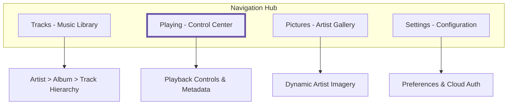
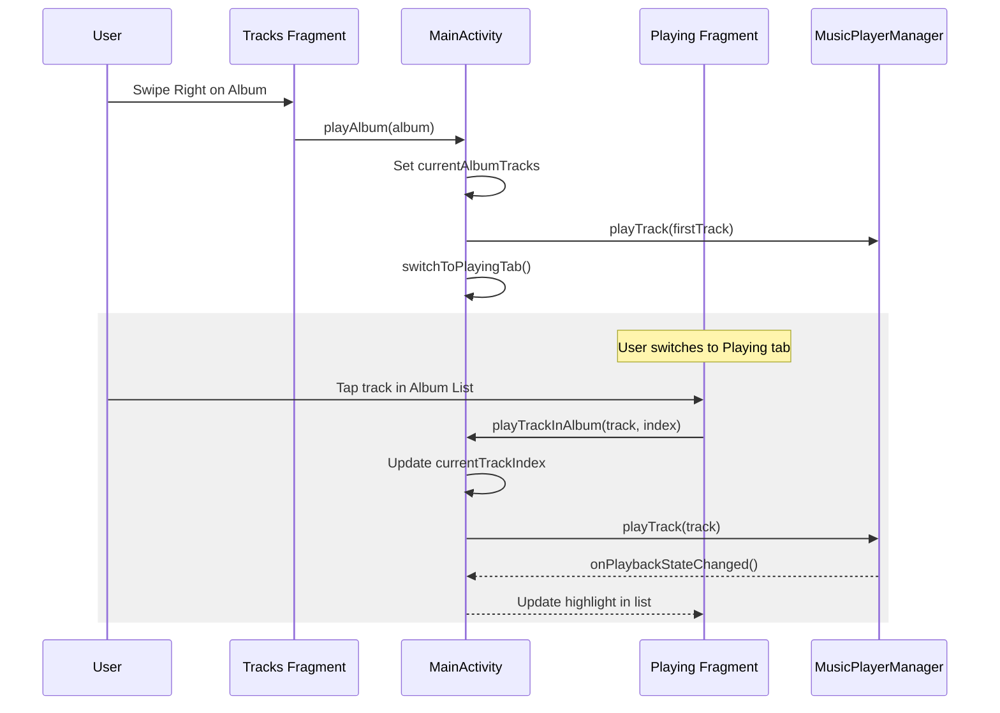
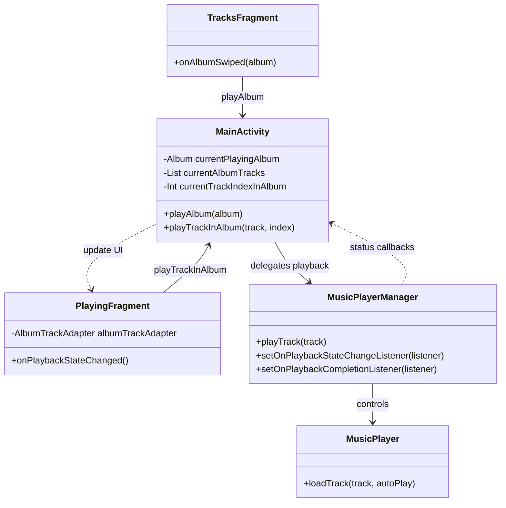

# UI and Feature Specification (Android Music Player)

This document specifies the user interface, interaction design, and functional requirements for SheepPlayer, a professional-grade Android music player built on **DDD**, **Clean Architecture**, and **Material 3**.

## 📱 User Experience Principles

-   **Uninterrupted Playback**: Music must continue playing seamlessly during navigation, configuration changes (rotation), and while the app is in the background.
-   **Material 3 & Dynamic Color**: Adheres to modern design standards, utilizing **Material You (Dynamic Color)** to harmonize the app's palette with the user's wallpaper.
-   **Edge-to-Edge Display**: The UI renders behind system bars (status and navigation) to provide a more immersive experience, using window insets for proper component spacing.
-   **Low Latency & Tactile Feedback**: All interactions (Play/Pause, Seek) provide immediate visual (Material Ripple) and haptic (vibration) feedback.
-   **Contextual Awareness**: The UI reflects the current playback state, track metadata, and data source (local vs. cloud) at all times.

## 🧭 Navigation & Information Architecture

The application uses a **Material 3 Bottom Navigation Bar**, providing high-reachability for ergonomic single-handed use.

### 1. Tracks Fragment (Library Browser)
-   **Hierarchy**: An accordion-style list (Artist → Album → Track) to manage large collections efficiently.
-   **Search**: A persistent **Material 3 SearchBar** at the top for real-time filtering of the domain library.
-   **Empty State**: When no music is found, a clear "No Music Found" illustration with a "Scan Again" button is displayed.
-   **Interactions**:
    -   **Swipe-to-Play**: Swiping a track/album right triggers immediate playback and navigates to the "Playing" tab.
    -   **Long Press**: Opens a bottom sheet for "Add to Playlist" or "Track Info".

### 2. Playing Fragment (Now Playing)
-   **Immersive Visuals**: Large album artwork in an `ElevatedCard`.
-   **Playback Controls**: 
    -   Central FAB for Play/Pause.
    -   Next/Previous and Stop buttons.
    -   **Seek Bar**: A Material 3 `Slider` for precise time scrubbing.
-   **Queue View**: A swipeable bottom sheet showing the upcoming tracks in the current playback session.

### 3. Pictures Fragment (Artist Gallery)
-   **Dynamic Gallery**: A staggered grid of validated artist images.
-   **Loading state**: An animated "Sheep" GIF at the end of the list indicates an active search.
-   **Shimmer**: Individual image slots use shimmer effects during the validation phase.

## 🔄 Interaction Flow: Updating Playing List

This flow describes how the playback queue (Playing List) is updated when a user interacts with the library.

### Updating Playing List Class Diagram

## 🔄 Syncing Status UX/UI

The application provides a unified "Running Icon" system to give users continuous feedback during whole play list updates or background synchronization.

### 1. Global Sync Indicator (The Running Icon)
-   **Visual Design**:
    -   **Component**: A rounded horizontal chip.
    -   **Color Palette**: Primary Teal background (`#009688`) with high-contrast White text and icons.
    -   **Motion**: Contains a small, white **Indeterminate ProgressBar** to indicate active processing.
    -   **Elevation**: `4dp` to ensure visibility over scrollable fragment content.
-   **Placement**: Positioned in the top-right corner of the `MainActivity` container, making it globally visible regardless of the active fragment tab.

### 2. Lifecycle and Transitions
The indicator follows the state of the `LibraryUpdateEvent` stream:
-   **START**: Appears immediately when a sync is initiated (via `Started` event).
-   **PERSIST**: Remains visible during the metadata fetching phase (multiple `Progress` events).
-   **FINISH**: Smoothly transitions to `GONE` only after the entire library is merged and stable (`Success` or `Error` events).

### 3. UX Rationale
-   **Cross-Fragment Visibility**: By placing the indicator in the `MainActivity` layout rather than individual fragments, the user receives uninterrupted feedback even while navigating between Tracks, Playing, and Pictures.
-   **Non-Blocking Feedback**: The indicator is small and positioned at the periphery, allowing the user to continue browsing the existing library while the update happens in the background.

## 🛠️ Feature Specifications

### 🔊 Audio Engine & System Integration
-   **Foreground Service**: Playback is managed by a service to ensure it survives activity destruction.
-   **MediaSession & Notifications**:
    -   Implements `MediaSessionCompat` for lock screen controls and system-level media integration.
    -   Displays a persistent **Media Notification** with album art, playback controls, and a "Close" action.
-   **Audio Focus**: Automatically handles transitions (pausing for calls, ducking for notifications).

### 📁 Data & Library Management
-   **Hybrid Discovery**: Merges `MediaStore` (local) and `GoogleDrive` (cloud) into a unified domain library.
-   **Persistence**: Uses a `LocalCacheDataSource` (Room) to store cloud metadata and user playlists.
-   **Global Sync Indicator**: A persistent teal chip with a "Syncing..." status appears in the top-right corner of the app during any library update. This provides a unified "running icon" across all fragments (Tracks, Playing, Pictures).
-   **Playlist Synchronization**: Background tasks update the domain library in real-time, with UI components observing the merged state.

### 🔐 Security & Integrity
-   **Path Sanitization**: All file paths are validated before any `File` or `Uri` operation.
-   **Image Validation**: Binary signatures (Magic Numbers) are verified for all downloaded imagery (JPEG, PNG, GIF, WebP, AVIF, HEIF).

## ♿ Accessibility & Inclusivity
-   **Contrast**: All text and icons meet WCAG 2.1 AA contrast ratios.
-   **Touch Targets**: Minimum 48x48dp for all interactive elements.
-   **TalkBack**: Descriptive `contentDescription` for every UI state change (e.g., "Song paused", "Scanning library").

## 🔮 Roadmap

| Phase | Focus | Key Features |
| :--- | :--- | :--- |
| **Phase 1** | Foundation | DDD Core, MediaStore Scan, Basic Playback, Security. |
| **Phase 2** | UX Polish | Seek Bar, MediaSession (Notification), Material 3 Styling. |
| **Phase 3** | Personalization | Playlists, Global Search, Dynamic Color support. |
| **Phase 4** | Cloud & Sync | Google Drive integration, Metadata caching. |
| **Phase 5** | Advanced | Equalizer, Sleep Timer, Widgets. |
