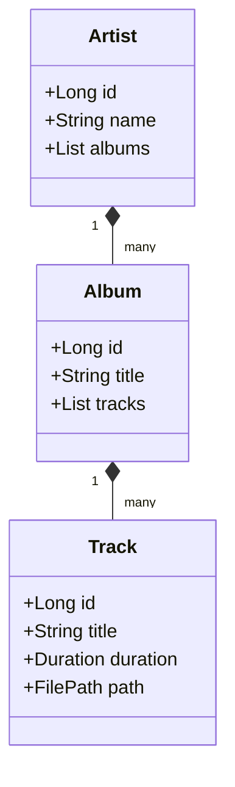
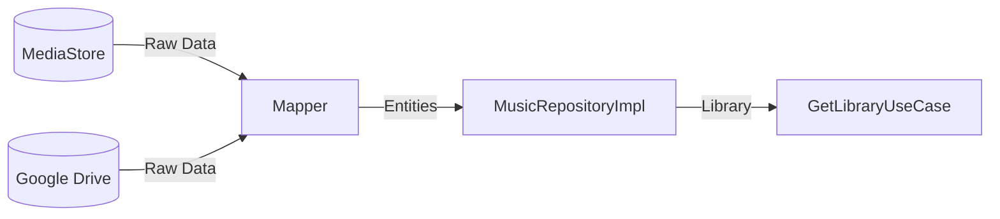

# Tutorial: Building a Clean Music Player

This tutorial guides you through the process of building the SheepPlayer Android application using **Domain-Driven Design (DDD)** and **Clean Architecture**.

By the end of this guide, you will have a deep understanding of:
-   How to partition a music player into architectural layers.
-   How to model core music concepts as Domain Entities.
-   How to decouple your business logic from the Android framework.

## 📐 Step 1: Design the Domain Model

The domain layer is the center of your application. It contains the business rules and is entirely independent of any framework.

1.  **Define the Aggregate Root**: The `Artist` is your root object, containing a list of `Albums`.
2.  **Define Entities**: The `Album` and `Track` are entities that belong to the `Artist` hierarchy.
3.  **Define Value Objects**: Use value objects like `Duration` to encapsulate time-related logic and `FilePath` for secure file access.

## 📜 Step 2: Define Use Cases (Interactors)

Use cases are the "what" of your application. They describe specific actions a user can take.

1.  **Get Library**: A use case to orchestrate the loading and organization of the music library.
2.  **Play Track**: A use case to validate a track and start the audio session.
3.  **Search Music**: A use case to filter the library based on a user's query.

## 💾 Step 3: Implement the Data Layer

The data layer is responsible for providing data to the domain. It adapts external sources like the Android `MediaStore` or Google Drive.

1.  **Implement the Repository**: The `MusicRepositoryImpl` is a bridge between your domain and the data sources.
2.  **Create Data Sources**: Wrappers around the `ContentResolver` (for local music) and the Google Drive API (for cloud music).
3.  **Map DTOs to Entities**: Use mappers to convert raw system data (DTOs) into your clean domain objects.

## 🎨 Step 4: Build the Presentation Layer

The presentation layer handles user interaction and renders the current state of the domain.

1.  **Implement ViewModels**: ViewModels act as a bridge between the UI and your use cases. They hold the reactive UI state.
2.  **Observe State**: Fragments observe the ViewModel's state and update the UI accordingly (e.g., showing a loading spinner while the library scans).
3.  **Trigger Actions**: User interactions (like a swipe) trigger the execution of a specific use case via the ViewModel.

## 🔊 Step 5: Infrastructure (Audio Engine)

The infrastructure layer contains the platform-specific implementation of domain requirements.

1.  **Implement the Player**: Create an `AndroidMusicPlayer` that uses the `MediaPlayer` API to fulfill the domain's playback commands.
2.  **Harden Security**: Implement the `PathValidator` to ensure all file paths comply with security rules before playback starts.

## 🧪 Step 6: Verify Your Architecture

A successful build follows the **Dependency Rule**:

-   **Domain Layer**: No dependencies on anything else.
-   **Data Layer**: Depends only on the Domain.
-   **Presentation Layer**: Depends only on the Domain.
-   **Infrastructure**: Depends on the Domain or Data layers as needed.

Congratulations! You've successfully built a clean, scalable, and testable music player architecture.
