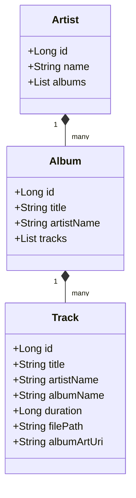
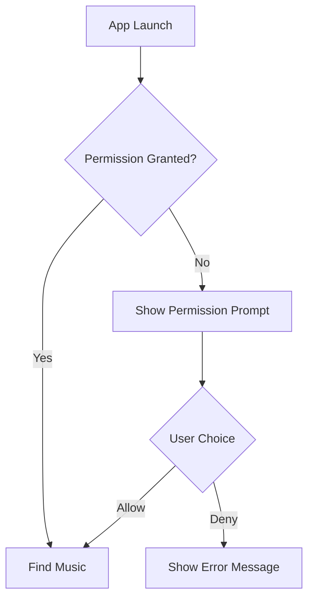

# Tutorial: Your First Music Player

In this tutorial, we'll build a music player app together from the ground up. You'll create an Android app that can find music on your device and play it back.

By the end of this tutorial, you will have:
- A working music player app foundation.
- Understanding of Android permissions.
- Experience with the MediaStore API.
- A logical structure for organizing music data.

## What You Need
Before we start, make sure you have:
- **Android Studio** installed.
- An **Android device or emulator** (Android 13+).
- Some **music files** on your device.

## Step 1: Create Your Project
Start by creating a new Android project in Android Studio:
1.  Select **"Empty Views Activity"**.
2.  Set the name to **"MusicPlayer"** and the package to `com.example.musicplayer`.
3.  Ensure the language is set to **Kotlin** and the Minimum SDK is **API 33 (Android 13.0)**.

## Step 2: Request Music Access
Android requires explicit permission to access the user's media files.
1.  Open the `AndroidManifest.xml` file.
2.  Add a request for `READ_MEDIA_AUDIO` for modern devices and `READ_EXTERNAL_STORAGE` (with a maximum SDK version of 32) for compatibility with older devices.
3.  These declarations tell the system that your app intends to read audio files from the device storage.

## Step 3: Define Music Data Structures
We need a way to organize the music information we find. Create a new file named `Data.kt` and define the following structure:

-   **Artist**: Holds the artist's identity and their albums.
-   **Album**: Holds the collection of tracks and the associated artist's name.
-   **Track**: Stores individual file details like title, duration, and the physical file path.

## Step 4: Handle User Permissions
In `MainActivity.kt`, implement the logic to check if the user has already granted permission. If not, use the system's permission launcher to request it.

Inform the user of the outcome using a Toast message: either confirming access or explaining why the permission is necessary.

## Step 5: Implement Music Discovery
Create a `MusicRepository` class to handle the interaction with the Android `MediaStore`.

1.  **Query the MediaStore**: Use the `contentResolver` to query the system's audio database for all files marked as music.
2.  **Extract Details**: Iterate through the results to collect IDs, titles, artist names, album titles, durations, and file paths.
3.  **Validate**: Ensure file paths are safe and extensions are valid.
4.  **Organize**: Group the individual tracks into the `Artist` → `Album` → `Track` hierarchy we defined in Step 3.

## Step 6: Connect and Display
Update the `MainActivity` to use the `MusicRepository` inside a background coroutine (to keep the UI responsive).

1.  **Initialize**: Set up the repository instance.
2.  **Trigger Loading**: When permission is granted, start the discovery process.
3.  **Summarize Results**: Calculate the total number of artists and songs found.
4.  **Notify User**: Display a message like "Found 12 artists with 156 songs!" to confirm success.

## What You Built
Congratulations! You've successfully built a music player foundation that:
✅ **Requests permissions** properly.
✅ **Discovers all music** on your device securely.
✅ **Organizes data** into a logical, hierarchical structure.
✅ **Operates smoothly** without freezing the user interface.

## What You Learned
- The lifecycle of Android permissions.
- How to use the MediaStore API to query system data.
- The benefit of structured data models for complex information.
- The importance of background processing for IO-intensive tasks.
