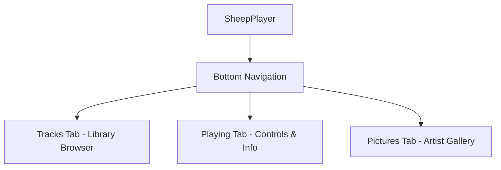
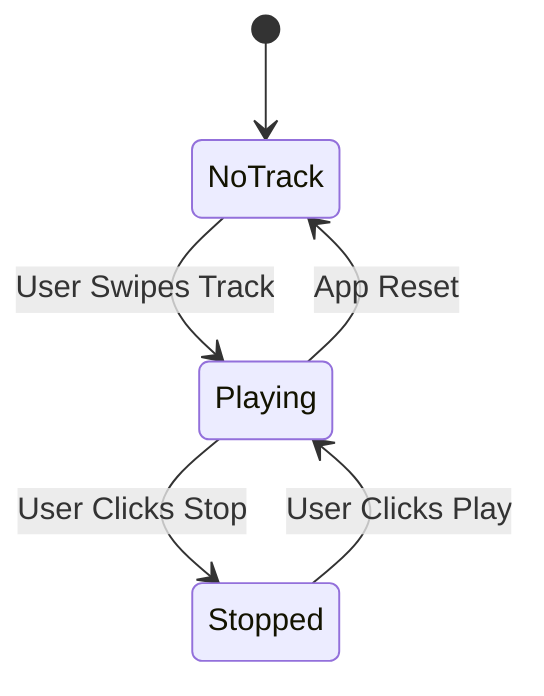

# UI and Feature Specification

User interface design and feature specification for SheepPlayer Android music player.

## Application Overview

SheepPlayer is a local music player that organizes audio files in a hierarchical structure. Users browse their music library by artists and albums, then play tracks using swipe gestures.

## User Interface Specification

### Navigation Structure

The application follows a simple, three-tab navigation model.

-   **Tracks**: Primary music library browser.
-   **Playing**: Current track display and transport controls.
-   **Pictures**: Artist image gallery with dynamic, secure downloading.

### Screen Layouts

#### Tracks Fragment
The primary view is a scrollable, hierarchical list.
-   **Artist Items**: Displays name and album count with an expand/collapse indicator.
-   **Album Items**: Displays artwork, title, and track count.
-   **Track Items**: Displays title and duration.
-   **Interactions**: Tapping artists or albums toggles their expansion state. Swiping a track to the right immediately starts playback and navigates the user to the Playing tab.

#### Playing Fragment
The interface dynamically adapts based on whether a track is currently active.

-   **No Track Selected**: Displays a centered message and instructions.
-   **Track Playing**: Features large album artwork, detailed track metadata, and a persistent time display (MM:SS / MM:SS).
-   **Transport Control**: A single, large circular button toggles between "Play" and "Stop" states.

#### Pictures Fragment
Provides a visual exploration experience synchronized with the current artist.
-   **Animated Feedback**: A searching placeholder appears while images are being discovered.
-   **Secure Discovery**: The service queries multiple engines and validates file signatures (magic numbers) before display.
-   **Gallery View**: A vertical list of high-quality, validated artist images.

### Visual Design
-   **Color Scheme**: Utilizes purple branding tones with teal interactive accents on standard Material Design surfaces.
-   **Typography**: Implements a clear visual hierarchy with artist names being the most prominent, followed by albums and tracks.
-   **Accessibility**: Ensures all touch targets are at least 48dp and provides high contrast for readability.

## Feature Specifications

### Core Features

#### Google Drive Integration
Seamlessly merges cloud-based music with the local library.
-   **Authentication**: Secure sign-in/out via the options menu.
-   **Discovery**: Background services crawl folders and extract metadata.
-   **Caching**: Local SQLite storage ensures fast access to previously discovered cloud tracks.

#### Music Library Management
-   **Source**: Utilizes the Android MediaStore API for fast, indexed discovery.
-   **Formats**: Supports MP3, M4A, WAV, FLAC, OGG, and AAC.
-   **Organization**: Automatically groups files into a logical Artist → Album → Track structure.

#### Audio Playback
Managed by the Android `MediaPlayer` with full support for audio focus and system interruption handling (e.g., pausing for incoming calls).

#### Security
-   **File Protection**: Validates every path and extension before use.
-   **Image Integrity**: Performs magic number checks on all downloaded artist images to block malicious content.

### Performance & Accessibility
-   **Efficiency**: Uses coroutines for all background tasks and `RecyclerView` for smooth, low-memory list performance.
-   **Screen Reader Support**: All elements include meaningful content descriptions for talkback compatibility.
-   **Interaction Alternatives**: Provides tap-based alternatives for all gesture-driven actions.

## Future Enhancements
-   **Phase 2**: Adding pause/resume capabilities, shuffle/repeat modes, and real-time library search.
-   **Phase 3**: Implementing a multi-band equalizer, sleep timer, and Android Auto integration.
