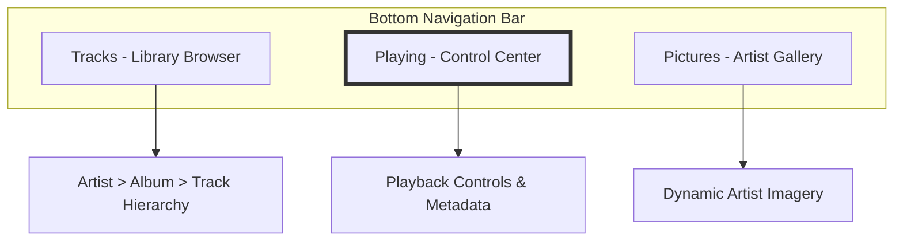
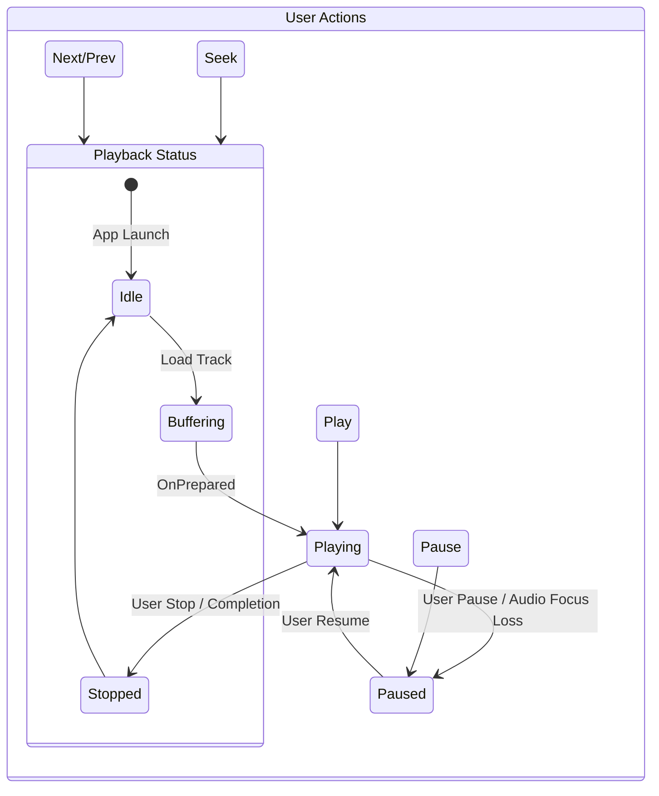

# UI and Feature Specification (Android Music Player)

This document specifies the user interface and functional requirements for SheepPlayer, a modern Android music player built on DDD and Clean Architecture.

## 📱 User Experience Principles

-   **Uninterrupted Playback**: Music should continue playing during navigation and while the app is in the background.
-   **Low Latency**: Interactions like Play/Pause and Seek must feel instantaneous.
-   **Visual Context**: The UI should reflect the current playback state and track metadata at all times.
-   **Security by Design**: Secure handling of local media, cloud files, and downloaded artist imagery.

## 🧭 Navigation & Information Architecture

The application uses a standard three-tab bottom navigation model, optimized for single-handed use.

### 1. Tracks Fragment (Library Browser)
The primary entry point for browsing the music collection.
-   **Hierarchical Navigation**: An accordion-style list (Artist → Album → Track) minimizes visual clutter.
-   **Cloud Integration**: Clear visual indicators (e.g., icons) distinguish local tracks from Google Drive tracks.
-   **Fast Interaction**: Swiping a track or album to the right triggers the `PlayMusicUseCase` and navigates immediately to the "Playing" tab.

### 2. Playing Fragment (Playback Control Center)
The central hub for managing the current audio session.

-   **Dynamic Metadata**: Large album artwork, track title, artist, and album name.
-   **Progress Control**: A seek bar (future) or position indicator showing current time vs. total duration.
-   **Transport Controls**: Large, accessible buttons for Play/Stop (and future Pause/Skip).
-   **Album Context**: A scrollable sub-list showing all tracks in the current album, highlighting the active one.

### 3. Pictures Fragment (Artist Discovery)
A visually immersive experience that dynamically fetches artist-related imagery.
-   **Secure Loading**: Every image is validated against magic numbers (JPEG, PNG, etc.) to ensure system integrity.
-   **Placeholder States**: An animated "Sheep" placeholder provides feedback during search and download operations.

## 🛠️ Feature Specifications

### 🔊 Audio Engine & Lifecycle
Managed by a dedicated service to ensure persistence across Activity recreations.
-   **Audio Focus**: Properly handles "ducking" (lowering volume for notifications) and pausing for phone calls.
-   **System Integration**: (Future) Media Session integration for lock screen and notification shade controls.
-   **Format Support**: Comprehensive support for MP3, M4A, WAV, FLAC, OGG, and AAC.

### 📁 Data & Library Management
-   **Domain-Driven Discovery**: Uses the `ScanLibraryUseCase` to query the `MusicRepository` (abstracting MediaStore and Google Drive).
-   **Background Sync**: Metadata extraction from cloud sources runs as a background job to prevent UI stutters.
-   **Sanitization**: All metadata and file paths are sanitized to prevent injection or directory traversal attacks.

### 🔐 Security Features
-   **Path Validation**: All file access requests are validated against a whitelist of supported audio directories.
-   **Signature Verification**: Downloaded artist images are checked for valid binary signatures before processing.
-   **Minimal Permissions**: The app adheres to the principle of least privilege, only requesting specific media permissions (API 33+).

## 🔮 Future Enhancements (Music Roadmap)
1.  **Phase 2: Playback Control**: Implement Seek, Pause, and Previous/Next functionality.
2.  **Phase 3: Playlists & Search**: Add Use Cases for custom playlist management and real-time global search.
3.  **Phase 4: System Integration**: Add a persistent Media Notification and lock screen controls via `MediaSessionCompat`.
